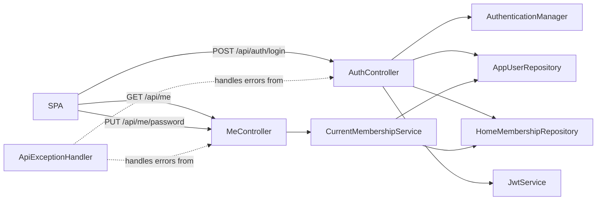

# Auth & Login

## Problem

The SPA needs a secure, consistent API prefix (`/api/**`) before any feature work begins. Today `POST /auth/login` returns only a token, there is no CORS policy, `@EnableMethodSecurity` is off so `@PreAuthorize` annotations are silently ignored, and there is no way for any endpoint to identify the currently logged-in user's home or role without duplicating the same four repository lookups. This plan installs all of that infrastructure plus the two `/api/me` endpoints the SPA consumes directly.

## Domain terms

Use these words across every slice doc.

- **AppUser**: the JPA entity stored in the `users` table; holds `email` and `passwordHash`. Not a Spring `UserDetails` — the `AppUserDetailsService` wraps it into one.
- **HomeMembership**: the join between an `AppUser` and a `Home`; carries the `Role` (currently only `OWNER`). One user → one membership → one home.
- **Home**: the household entity; has an `id` and a `name`.
- **Role**: the `OWNER` enum value stored on `HomeMembership`; surfaced as `ROLE_OWNER` in the JWT and Spring's security context.
- **JWT**: the signed token issued by `JwtService`; its `sub` claim is the user's email and its `role` claim is the `Role` name.
- **Snapshot**: the `CurrentMembershipService.Snapshot` record — `(AppUser user, HomeMembership membership, Home home)` — resolved from a valid `Authentication`. Every protected endpoint uses this instead of repeating repository lookups.
- **CurrentMembershipService**: the `@Service` that resolves an `Authentication` → `Snapshot`; missing user → 401, missing membership → 403.

## System data flow

## Slices

1. **[Security hardening](01-security-hardening.md)** — Adds `spring-boot-starter-validation`, CORS configuration, and `@EnableMethodSecurity` to the security layer. First because every other slice depends on the validation annotation processor and the `/api/**` path matcher.
2. **[Login enrichment](02-login-enrichment.md)** — Moves `AuthController` to `/api/auth`, adds `@Valid`/`@NotBlank`, and returns `email` + `role` alongside the token. Needs slice 1's validation dependency and the updated `permitAll` path.
3. **[Exception handler](03-exception-handler.md)** — Creates `AccountNotFoundException` (used by future treasury slices) and `ApiExceptionHandler` mapping validation errors → 400, unknown accounts → 404, and bank outages → 502. Needs slice 1's validation dependency so `MethodArgumentNotValidException` is thrown correctly.
4. **[CurrentMembershipService](04-current-membership-service.md)** — Creates the shared `require(Authentication) → Snapshot` service. Independent of slices 1–3; ordered here so slices 5 and 6 can use it.
5. **[GET /api/me](05-me-get.md)** — Returns the authenticated user's email, role, and home summary. Needs slice 4's `CurrentMembershipService`.
6. **[PUT /api/me/password](06-me-password.md)** — Lets the authenticated user change their password. Needs slice 4's `CurrentMembershipService` and slice 5's `MeController` (adds a method to the same class).
7. **[Tests](07-tests.md)** — `AuthControllerTest` and `MeControllerTest`. Needs all prior slices complete.
8. **[Registration](08-registration.md)** — Adds `POST /api/auth/register` with create-household and join-household paths. Introduces `HomeInvite` entity and `RegistrationService`. Deletes the single-user seed infrastructure (`HomeInitializer`, `OwnerInitializer`, `HomeProperties`, `OwnerProperties`). Needs all prior slices complete.
9. **[Invite generation](09-invite-generation.md)** — Adds `POST /api/home/invites` (OWNER only) that produces the short-lived codes consumed by the join path in slice 8. Also migrates `HomeController` to `/api/home` and refactors it to use `CurrentMembershipService`. Needs slices 4 and 8.

## Out of scope (epic-wide)

- Token refresh or logout / token invalidation.
- Multi-home membership (current model: one user → one home).
- Role promotion after joining (VIEWER → OWNER managed by a future Membership Administration epic).
- Listing or revoking active invites.
