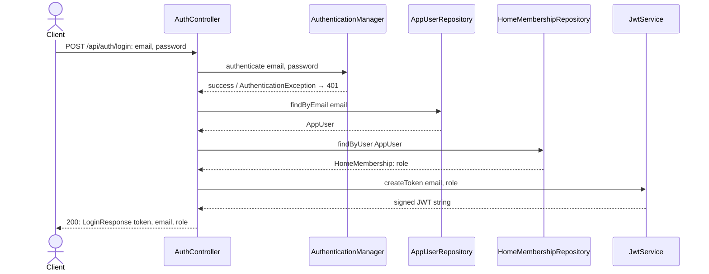

# Login enrichment

## What it does

Validates login inputs and returns the user's email and role alongside the token so the SPA can display profile information without a second request.

## Why

Two problems with the current `POST /auth/login`:

1. **No input validation** — a blank email silently reaches `AuthenticationManager`, which throws an opaque error rather than a clear 400. Slice 01 adds the validation interceptor; this slice adds `@NotBlank` and `@Valid` to use it.
2. **Response only carries** `token` — the SPA needs the user's email and role for display and routing decisions. Without them it must make an immediate follow-up `GET /api/me` call, or decode the JWT client-side, both of which add round-trips or coupling. Adding `email` and `role` to `LoginResponse` costs nothing at the server.

The path moves from `/auth/login` to `/api/auth/login` so all API traffic shares the `/api/**` CORS and security rules configured in slice 01.

## Data flow




## Today → after

**Today** in `[LoginRequest.java](../../src/main/java/com/glpalma/HomeTreasury/auth/LoginRequest.java)` (line 3): `public record LoginRequest(String email, String password)` — no validation constraints.

**Today** in `[LoginResponse.java](../../src/main/java/com/glpalma/HomeTreasury/auth/LoginResponse.java)` (line 3): `public record LoginResponse(String token)` — single field.

**Today** in `[AuthController.java](../../src/main/java/com/glpalma/HomeTreasury/auth/AuthController.java)`:

- `@RequestMapping("/auth")` — old prefix without `/api`.
- `login(@RequestBody LoginRequest request)` — no `@Valid`.
- Returns `new LoginResponse(token)` — no `email` or `role`.

**After:** all three files updated; `LoginResponse` gains two fields; controller validates inputs and passes the new fields through.

## Exact changes

Files ordered: DTOs first (records referenced by the controller) → controller last.

- [x] **Edit** `[src/main/java/com/glpalma/HomeTreasury/auth/LoginRequest.java](../../src/main/java/com/glpalma/HomeTreasury/auth/LoginRequest.java)` — add `@NotBlank` to both fields
  ```java
  package com.glpalma.HomeTreasury.auth;

  import jakarta.validation.constraints.NotBlank;

  public record LoginRequest(@NotBlank String email, @NotBlank String password) {
  }
  ```

- [x] **Edit** `[src/main/java/com/glpalma/HomeTreasury/auth/LoginResponse.java](../../src/main/java/com/glpalma/HomeTreasury/auth/LoginResponse.java)` — add `email` and `role` fields
  ```java
  package com.glpalma.HomeTreasury.auth;

  public record LoginResponse(String token, String email, String role) {
  }
  ```

- [x] **Edit** `[src/main/java/com/glpalma/HomeTreasury/auth/AuthController.java](../../src/main/java/com/glpalma/HomeTreasury/auth/AuthController.java)` — move to `/api/auth`, add `@Valid`, return richer `LoginResponse`
  ```java
  package com.glpalma.HomeTreasury.auth;

  import com.glpalma.HomeTreasury.user.AppUser;
  import com.glpalma.HomeTreasury.user.AppUserRepository;
  import com.glpalma.HomeTreasury.user.HomeMembership;
  import com.glpalma.HomeTreasury.user.HomeMembershipRepository;
  import jakarta.validation.Valid;
  import org.springframework.http.HttpStatus;
  import org.springframework.security.authentication.AuthenticationManager;
  import org.springframework.security.authentication.UsernamePasswordAuthenticationToken;
  import org.springframework.security.core.AuthenticationException;
  import org.springframework.web.bind.annotation.*;
  import org.springframework.web.server.ResponseStatusException;

  @RestController
  @RequestMapping("/api/auth")
  public class AuthController {

      private final AuthenticationManager authenticationManager;
      private final AppUserRepository users;
      private final HomeMembershipRepository memberships;
      private final JwtService jwtService;

      public AuthController(
              AuthenticationManager authenticationManager,
              AppUserRepository users,
              HomeMembershipRepository memberships,
              JwtService jwtService
      ) {
          this.authenticationManager = authenticationManager;
          this.users = users;
          this.memberships = memberships;
          this.jwtService = jwtService;
      }

      @PostMapping("/login")
      public LoginResponse login(@Valid @RequestBody LoginRequest request) {
          try {
              authenticationManager.authenticate(
                      new UsernamePasswordAuthenticationToken(request.email(), request.password())
              );
          } catch (AuthenticationException ex) {
              throw new ResponseStatusException(HttpStatus.UNAUTHORIZED, "Invalid credentials");
          }
          AppUser user = users.findByEmail(request.email())
                  .orElseThrow(() -> new ResponseStatusException(HttpStatus.UNAUTHORIZED, "Invalid credentials"));
          HomeMembership membership = memberships.findByUser(user)
                  .orElseThrow(() -> new ResponseStatusException(HttpStatus.UNAUTHORIZED, "Invalid credentials"));
          String token = jwtService.createToken(user.getEmail(), membership.getRole().name());
          return new LoginResponse(token, user.getEmail(), membership.getRole().name());
      }
  }
  ```


## Verify

1. Start the application (slice 01 must be implemented first).
2. Send a valid login:
  ```
   curl -i -X POST http://localhost:8080/api/auth/login \
     -H "Content-Type: application/json" \
     -d '{"email":"owner@example.com","password":"your-password"}'
  ```
3. Expect `200` with body:
  ```json
   { "token": "<jwt>", "email": "owner@example.com", "role": "OWNER" }
  ```
4. Send a blank email:
  ```
   curl -i -X POST http://localhost:8080/api/auth/login \
     -H "Content-Type: application/json" \
     -d '{"email":"","password":"secret"}'
  ```
5. Expect `400` with a body containing an `errors` array (once slice 03's `ApiExceptionHandler` is in place; before that, Spring returns its default 400 shape).
6. Send wrong credentials:
  ```
   curl -i -X POST http://localhost:8080/api/auth/login \
     -H "Content-Type: application/json" \
     -d '{"email":"owner@example.com","password":"wrong"}'
  ```
7. Expect `401`.


## Out of scope

- Changing what `JwtService.createToken` puts in the token — the JWT payload is unchanged.
- Returning home information in the login response — that's `GET /api/me` (slice 05).
- Invalidating or refreshing tokens.

