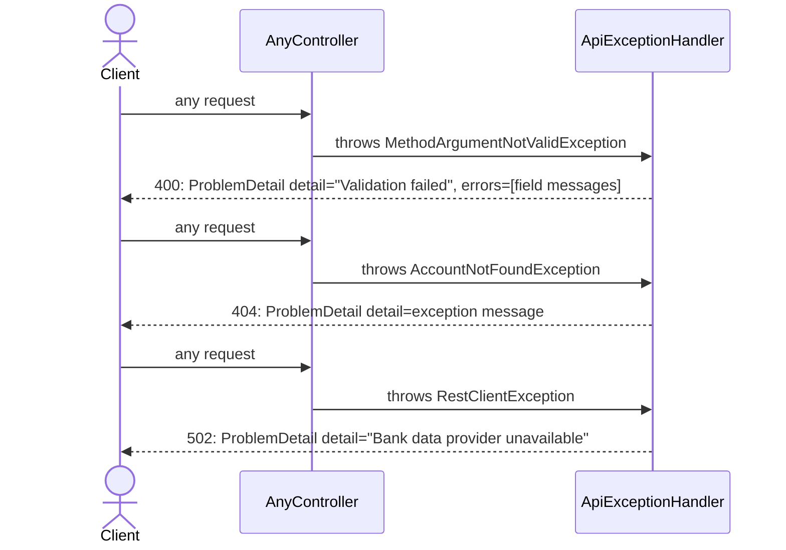

# Exception handler

## What it does

Installs a global `@RestControllerAdvice` that maps three exception types to RFC 7807 problem-detail responses — validation errors → 400, unknown bank accounts → 404, bank provider outages → 502 — so every controller gets consistent error bodies for free.

## Why

Without a global handler each controller has two bad options: let Spring's `DefaultHandlerExceptionResolver` produce its default error shape (inconsistent, not RFC 7807), or add `@ExceptionHandler` methods to every controller individually (duplicated logic, easy to forget). `@RestControllerAdvice` applies to all controllers in one place.

`AccountNotFoundException` does not exist yet in the `treasury` package — it is referenced by `ApiExceptionHandler` and by future treasury slices. It must be created here so the handler compiles. Placing it in `treasury` (not `web`) keeps the exception co-located with the code that will throw it; the handler in `web` depends on `treasury`, not the other way around.

`ResponseStatusException` is deliberately not caught — Spring resolves it automatically into the correct HTTP status, so catching it here would shadow that behaviour.

## Data flow

No new HTTP endpoint. The handler intercepts exceptions thrown by any `@RestController` during request processing:



## Exact changes

Files ordered: exception class (referenced by handler) → handler.

- [ ] **New** [`src/main/java/com/glpalma/HomeTreasury/treasury/AccountNotFoundException.java`](../../src/main/java/com/glpalma/HomeTreasury/treasury/AccountNotFoundException.java) — typed exception for treasury lookups that find no matching account; placed in `treasury` so throwing code and exception type are co-located

  ```java
  package com.glpalma.HomeTreasury.treasury;

  public class AccountNotFoundException extends RuntimeException {

      public AccountNotFoundException(String accountId) {
          super("Account not found: " + accountId);
      }
  }
  ```

- [ ] **New** [`src/main/java/com/glpalma/HomeTreasury/web/ApiExceptionHandler.java`](../../src/main/java/com/glpalma/HomeTreasury/web/ApiExceptionHandler.java) — global `@RestControllerAdvice` in a new `web` package; keeps error-mapping logic out of individual controllers

  ```java
  package com.glpalma.HomeTreasury.web;

  import com.glpalma.HomeTreasury.treasury.AccountNotFoundException;
  import org.springframework.http.HttpStatus;
  import org.springframework.http.ProblemDetail;
  import org.springframework.web.bind.MethodArgumentNotValidException;
  import org.springframework.web.bind.annotation.ExceptionHandler;
  import org.springframework.web.bind.annotation.RestControllerAdvice;
  import org.springframework.web.client.RestClientException;

  @RestControllerAdvice
  public class ApiExceptionHandler {

      @ExceptionHandler(MethodArgumentNotValidException.class)
      ProblemDetail validation(MethodArgumentNotValidException ex) {
          ProblemDetail detail = ProblemDetail.forStatusAndDetail(HttpStatus.BAD_REQUEST, "Validation failed");
          detail.setProperty("errors", ex.getBindingResult().getFieldErrors().stream()
                  .map(err -> err.getField() + " " + err.getDefaultMessage())
                  .toList());
          return detail;
      }

      @ExceptionHandler(AccountNotFoundException.class)
      ProblemDetail unknownAccount(AccountNotFoundException ex) {
          return ProblemDetail.forStatusAndDetail(HttpStatus.NOT_FOUND, ex.getMessage());
      }

      @ExceptionHandler(RestClientException.class)
      ProblemDetail pluggyDown(RestClientException ex) {
          return ProblemDetail.forStatusAndDetail(HttpStatus.BAD_GATEWAY, "Bank data provider unavailable");
      }
  }
  ```

## Verify

1. Implement slice 02 first (so `@Valid` is present on `AuthController.login`).
2. Send a request with a blank password:
   ```
   curl -i -X POST http://localhost:8080/api/auth/login \
     -H "Content-Type: application/json" \
     -d '{"email":"owner@example.com","password":""}'
   ```
3. Expect `400` with body:
   ```json
   {
     "status": 400,
     "detail": "Validation failed",
     "errors": ["password must not be blank"]
   }
   ```
4. Confirm `ResponseStatusException` still works — send wrong credentials:
   ```
   curl -i -X POST http://localhost:8080/api/auth/login \
     -H "Content-Type: application/json" \
     -d '{"email":"owner@example.com","password":"wrong"}'
   ```
5. Expect `401` (not intercepted by `ApiExceptionHandler` — Spring resolves `ResponseStatusException` directly).

## Out of scope

- Catching `ResponseStatusException` — Spring handles it automatically.
- Handling `AccessDeniedException` — Spring Security already maps this to 403.
- Adding `AccountNotFoundException` throwing sites — those belong to the future treasury slices.
- A custom error body shape beyond RFC 7807 `ProblemDetail`.
