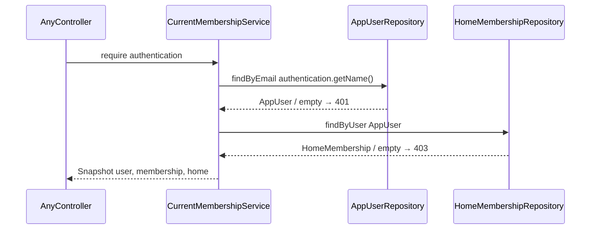

# CurrentMembershipService

## What it does

Resolves any JWT-authenticated request to a typed `Snapshot(user, membership, home)` so every protected endpoint can identify the caller's full context in one call instead of repeating the same two repository lookups.

## Why

`GET /api/me` (slice 05) and `PUT /api/me/password` (slice 06) both need the caller's `AppUser`, `HomeMembership`, and `Home`. Without this service each controller would duplicate:

```java
AppUser user = users.findByEmail(authentication.getName()).orElseThrow(...);
HomeMembership membership = memberships.findByUser(user).orElseThrow(...);
Home home = membership.getHome();
```

`CurrentMembershipService` wraps that into a single `require(Authentication)` call that also enforces consistent error codes: missing user → 401 (the JWT refers to an account that no longer exists), missing membership → 403 (the user exists but has no home, which should never happen in production but must be handled defensively). Future treasury and home-settings slices depend on this service by the same contract.

## Data flow

No new HTTP endpoint. Internal call path from any controller that uses the service:



## Exact changes

- [ ] **New** [`src/main/java/com/glpalma/HomeTreasury/user/CurrentMembershipService.java`](../../src/main/java/com/glpalma/HomeTreasury/user/CurrentMembershipService.java) — `@Service` with inner `Snapshot` record; placed in `user` package alongside the entities and repositories it depends on

  ```java
  package com.glpalma.HomeTreasury.user;

  import com.glpalma.HomeTreasury.home.Home;
  import org.springframework.http.HttpStatus;
  import org.springframework.security.core.Authentication;
  import org.springframework.stereotype.Service;
  import org.springframework.web.server.ResponseStatusException;

  @Service
  public class CurrentMembershipService {

      public record Snapshot(AppUser user, HomeMembership membership, Home home) {
      }

      private final AppUserRepository users;
      private final HomeMembershipRepository memberships;

      public CurrentMembershipService(AppUserRepository users, HomeMembershipRepository memberships) {
          this.users = users;
          this.memberships = memberships;
      }

      public Snapshot require(Authentication authentication) {
          String email = authentication.getName();
          AppUser user = users.findByEmail(email)
                  .orElseThrow(() -> new ResponseStatusException(HttpStatus.UNAUTHORIZED));
          HomeMembership membership = memberships.findByUser(user)
                  .orElseThrow(() -> new ResponseStatusException(HttpStatus.FORBIDDEN));
          return new Snapshot(user, membership, membership.getHome());
      }
  }
  ```

## Verify

This service has no HTTP endpoint of its own. Verify it indirectly through slice 05's `GET /api/me`:

1. Implement slice 05.
2. Call `GET /api/me` with a valid Bearer token → expect `200` with correct `email`, `role`, and `home`.
3. Call `GET /api/me` with no token → expect `401` (from `SecurityConfig`, not from this service).
4. To test the "missing membership" path in isolation, delete the `HomeMembership` row for the owner directly in the DB, then call `GET /api/me` → expect `403`.

## Out of scope

- Caching the lookup result — each request re-reads from the DB; caching is a future concern.
- Supporting users with multiple home memberships — current model is one user → one membership.
- Exposing `Snapshot` outside the `user` package — callers import `CurrentMembershipService.Snapshot`.
