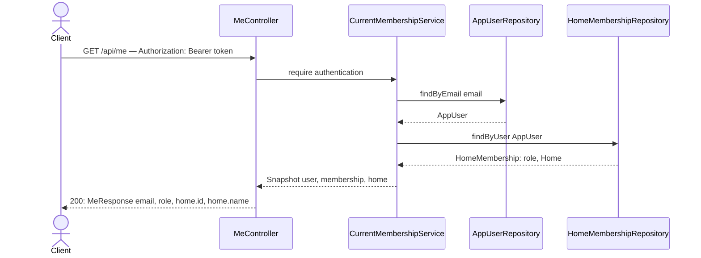

# GET /api/me

## What it does

Returns the authenticated user's email, role, and home name so the SPA can render the user profile without decoding the JWT.

## Why

The SPA needs the user's role to decide which navigation items to show and the home name to display in the header. Both are already available server-side from the `Snapshot` resolved by `CurrentMembershipService` (slice 04). Exposing them via `GET /api/me` avoids any client-side JWT parsing and gives the SPA a single stable source of truth for session data.

`MeResponse` uses a nested `HomeSummary(id, name)` rather than exposing `Home` directly so the response shape is independent of the `Home` JPA entity's field evolution.

## Data flow



## Exact changes

Files ordered: response DTO → controller.

- [ ] **New** [`src/main/java/com/glpalma/HomeTreasury/user/MeResponse.java`](../../src/main/java/com/glpalma/HomeTreasury/user/MeResponse.java) — response record with a nested `HomeSummary` to decouple the response shape from the `Home` entity

  ```java
  package com.glpalma.HomeTreasury.user;

  public record MeResponse(String email, String role, HomeSummary home) {

      public record HomeSummary(Long id, String name) {
      }
  }
  ```

- [ ] **New** [`src/main/java/com/glpalma/HomeTreasury/user/MeController.java`](../../src/main/java/com/glpalma/HomeTreasury/user/MeController.java) — `GET /api/me` only; slice 06 will add `PUT /api/me/password` to this same class

  ```java
  package com.glpalma.HomeTreasury.user;

  import org.springframework.security.core.Authentication;
  import org.springframework.web.bind.annotation.GetMapping;
  import org.springframework.web.bind.annotation.RequestMapping;
  import org.springframework.web.bind.annotation.RestController;

  @RestController
  @RequestMapping("/api/me")
  public class MeController {

      private final CurrentMembershipService memberships;

      public MeController(CurrentMembershipService memberships) {
          this.memberships = memberships;
      }

      @GetMapping
      public MeResponse me(Authentication authentication) {
          var snapshot = memberships.require(authentication);
          return new MeResponse(
                  snapshot.user().getEmail(),
                  snapshot.membership().getRole().name(),
                  new MeResponse.HomeSummary(snapshot.home().getId(), snapshot.home().getName())
          );
      }
  }
  ```

## Verify

1. Obtain a token from `POST /api/auth/login` (slice 02 must be implemented):
   ```
   curl -s -X POST http://localhost:8080/api/auth/login \
     -H "Content-Type: application/json" \
     -d '{"email":"owner@example.com","password":"your-password"}' \
     | jq -r .token
   ```
   Save the result as `$TOKEN`.
2. Call `GET /api/me`:
   ```
   curl -i http://localhost:8080/api/me \
     -H "Authorization: Bearer $TOKEN"
   ```
3. Expect `200` with body:
   ```json
   {
     "email": "owner@example.com",
     "role": "OWNER",
     "home": { "id": 1, "name": "My Home" }
   }
   ```
4. Call without a token:
   ```
   curl -i http://localhost:8080/api/me
   ```
5. Expect `401`.

## Out of scope

- Returning pluggy account data or balance in this response — that's a treasury endpoint.
- Changing the password — that's slice 06.
- Letting the user update their email or display name.
