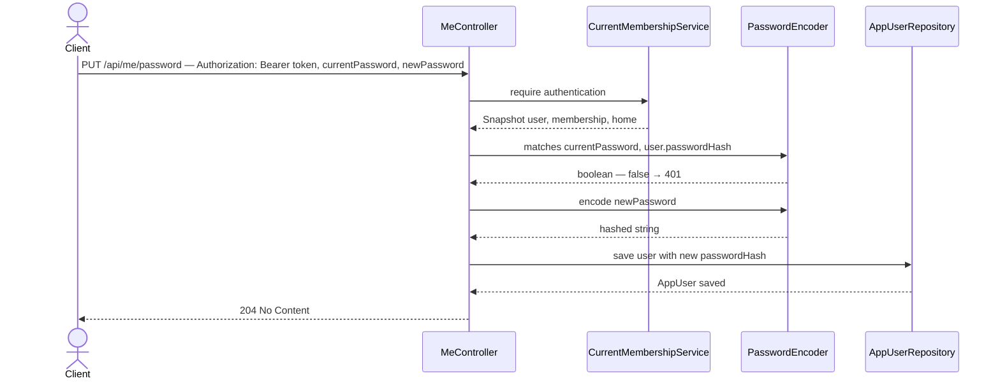

# PUT /api/me/password

## What it does

Lets the authenticated user change their own password by providing their current password for confirmation and a new password of at least 8 characters.

## Why

Password changes require knowing the current password (re-authentication) to prevent an attacker who grabbed a valid JWT from locking out the real user. `PasswordEncoder.matches` does the verification without exposing the raw hash.

`AppUser` currently has no `setPasswordHash` mutator — the entity was designed read-only for password-related fields. A setter is the minimal change needed; the alternative (a custom JPQL update query on the repository) would bypass JPA's dirty-checking and is harder to read.

The endpoint lives in `MeController` alongside `GET /api/me` (slice 05) because both operate on the current user's own data. Slice 05 creates the controller; this slice adds one method to it.

## Data flow



## Today → after

**Today** in [`AppUser.java`](../../src/main/java/com/glpalma/HomeTreasury/user/AppUser.java): `getPasswordHash()` is present but there is no `setPasswordHash`. The field `passwordHash` is `private` with no setter.

**Today** [`MeController.java`](../../src/main/java/com/glpalma/HomeTreasury/user/MeController.java): created in slice 05 with only `GET /api/me`. This slice adds `PUT /api/me/password` and the two extra constructor dependencies.

**After:** `AppUser` gains `setPasswordHash`; `MeController` gains `changePassword` with full dependency injection.

## Exact changes

Files ordered: entity mutator → request DTO → controller (the controller references both).

- [ ] **Edit** [`src/main/java/com/glpalma/HomeTreasury/user/AppUser.java`](../../src/main/java/com/glpalma/HomeTreasury/user/AppUser.java) — add `setPasswordHash` so `MeController` can update the password and save via JPA dirty-checking

  ```java
  package com.glpalma.HomeTreasury.user;

  import jakarta.persistence.*;

  @Entity
  @Table(name = "users")
  public class AppUser {

      @Id
      @GeneratedValue(strategy = GenerationType.IDENTITY)
      private Long id;

      @Column(nullable = false, unique = true)
      private String email;

      @Column(nullable = false)
      private String passwordHash;

      protected AppUser() {
      }

      public AppUser(String email, String passwordHash) {
          this.email = email;
          this.passwordHash = passwordHash;
      }

      public String getEmail() {
          return email;
      }

      public Long getId() {
          return id;
      }

      public String getPasswordHash() {
          return passwordHash;
      }

      public void setPasswordHash(String passwordHash) {
          this.passwordHash = passwordHash;
      }
  }
  ```

- [ ] **New** [`src/main/java/com/glpalma/HomeTreasury/user/ChangePasswordRequest.java`](../../src/main/java/com/glpalma/HomeTreasury/user/ChangePasswordRequest.java) — request DTO with validation constraints; `@Size(min=8)` enforces a minimum length before the hash is computed

  ```java
  package com.glpalma.HomeTreasury.user;

  import jakarta.validation.constraints.NotBlank;
  import jakarta.validation.constraints.Size;

  public record ChangePasswordRequest(
          @NotBlank String currentPassword,
          @NotBlank @Size(min = 8) String newPassword
  ) {
  }
  ```

- [ ] **Edit** [`src/main/java/com/glpalma/HomeTreasury/user/MeController.java`](../../src/main/java/com/glpalma/HomeTreasury/user/MeController.java) — add `PUT /api/me/password`; inject `AppUserRepository` and `PasswordEncoder` which `changePassword` needs

  ```java
  package com.glpalma.HomeTreasury.user;

  import jakarta.validation.Valid;
  import org.springframework.http.HttpStatus;
  import org.springframework.security.core.Authentication;
  import org.springframework.security.crypto.password.PasswordEncoder;
  import org.springframework.web.bind.annotation.*;
  import org.springframework.web.server.ResponseStatusException;

  @RestController
  @RequestMapping("/api/me")
  public class MeController {

      private final CurrentMembershipService memberships;
      private final AppUserRepository users;
      private final PasswordEncoder passwordEncoder;

      public MeController(
              CurrentMembershipService memberships,
              AppUserRepository users,
              PasswordEncoder passwordEncoder
      ) {
          this.memberships = memberships;
          this.users = users;
          this.passwordEncoder = passwordEncoder;
      }

      @GetMapping
      public MeResponse me(Authentication authentication) {
          var snapshot = memberships.require(authentication);
          return new MeResponse(
                  snapshot.user().getEmail(),
                  snapshot.membership().getRole().name(),
                  new MeResponse.HomeSummary(snapshot.home().getId(), snapshot.home().getName())
          );
      }

      @PutMapping("/password")
      @ResponseStatus(HttpStatus.NO_CONTENT)
      public void changePassword(
              @Valid @RequestBody ChangePasswordRequest request,
              Authentication authentication
      ) {
          AppUser user = memberships.require(authentication).user();
          if (!passwordEncoder.matches(request.currentPassword(), user.getPasswordHash())) {
              throw new ResponseStatusException(HttpStatus.UNAUTHORIZED, "Invalid current password");
          }
          user.setPasswordHash(passwordEncoder.encode(request.newPassword()));
          users.save(user);
      }
  }
  ```

## Verify

1. Obtain a token: `POST /api/auth/login` with the owner's current credentials; save as `$TOKEN`.
2. Change the password:
   ```
   curl -i -X PUT http://localhost:8080/api/me/password \
     -H "Authorization: Bearer $TOKEN" \
     -H "Content-Type: application/json" \
     -d '{"currentPassword":"your-password","newPassword":"newpassword123"}'
   ```
3. Expect `204 No Content`.
4. Verify the old password no longer works:
   ```
   curl -i -X POST http://localhost:8080/api/auth/login \
     -H "Content-Type: application/json" \
     -d '{"email":"owner@example.com","password":"your-password"}'
   ```
5. Expect `401`.
6. Verify the new password works:
   ```
   curl -i -X POST http://localhost:8080/api/auth/login \
     -H "Content-Type: application/json" \
     -d '{"email":"owner@example.com","password":"newpassword123"}'
   ```
7. Expect `200` with `token`, `email`, `role`.
8. Test too-short new password:
   ```
   curl -i -X PUT http://localhost:8080/api/me/password \
     -H "Authorization: Bearer $TOKEN" \
     -H "Content-Type: application/json" \
     -d '{"currentPassword":"your-password","newPassword":"short"}'
   ```
9. Expect `400` with `errors` array containing `newPassword size must be between 8 and ...`.
10. Test wrong current password:
    ```
    curl -i -X PUT http://localhost:8080/api/me/password \
      -H "Authorization: Bearer $TOKEN" \
      -H "Content-Type: application/json" \
      -d '{"currentPassword":"wrong","newPassword":"newpassword123"}'
    ```
11. Expect `401`.

## Out of scope

- Notifying the user by email after a password change.
- Expiring or invalidating the existing JWT after the password changes — the token remains valid until it expires naturally.
- Admin-initiated password resets (no token required) — that's a future slice.
