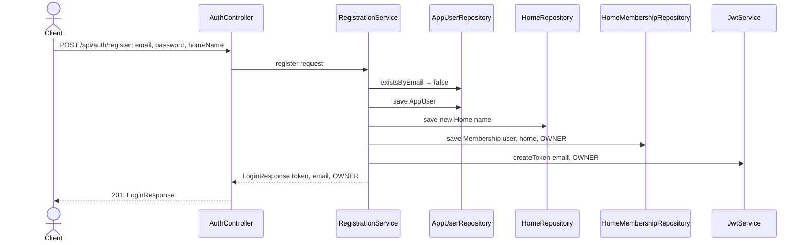
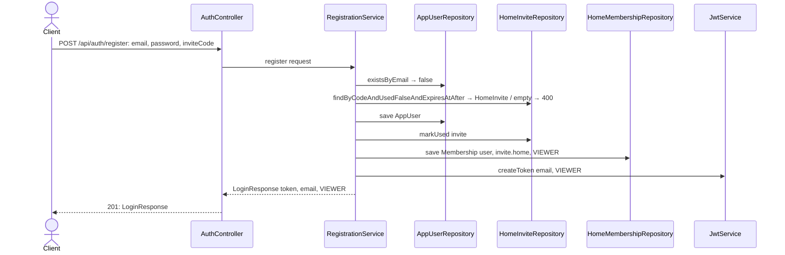

# Registration

## What it does

Adds `POST /api/auth/register` so new users can self-register. The caller either creates a brand-new household by supplying a `homeName`, or joins an existing household by supplying an `inviteCode` generated by an OWNER (slice 09). On success the endpoint returns the same `LoginResponse` as login so the SPA logs the user in immediately after registration.

This slice also deletes the static-seed infrastructure (`HomeInitializer`, `OwnerInitializer`, `HomeProperties`, `OwnerProperties`) that assumed a single hard-coded user and home, and updates `MeControllerTest` (slice 07) which relied on those beans.

## Why

`OwnerInitializer` and `HomeInitializer` are incompatible with multi-user: they create exactly one home and one owner at startup from config values, so adding a second user requires editing `.env` and restarting the server. Registration replaces them with an HTTP endpoint that anyone can call.

The two paths (create vs. join) live in `RegistrationService` rather than directly in `AuthController` because the logic is `@Transactional` — if the `HomeMembership` save fails after the `AppUser` has already been saved, the whole operation must roll back. Controllers should not own transaction boundaries.

`HomeInvite` is introduced here rather than in slice 09 because the join path in `RegistrationService` must query it. Slice 09 then adds the endpoint that *creates* invite rows.

## Data flow

### Create path (`homeName` provided, no `inviteCode`)



### Join path (`inviteCode` provided, no `homeName`)



## Today → after

**Deleted:** `OwnerInitializer.java`, `HomeInitializer.java`, `OwnerProperties.java`, `HomeProperties.java` — no longer needed; self-registration replaces both.

**Removed from `application.properties`:** `home.*` and `owner.*` key groups.

**Removed from `HomeTreasuryApplication.java`:** `HomeProperties.class` and `OwnerProperties.class` from `@EnableConfigurationProperties`.

**`Home.java`:** gains a single-arg constructor `Home(String name)` that leaves `idealBalance` null. Used by the create path of `RegistrationService` (the user hasn't set a target yet) and fixes an existing compilation error in the slice 07 test which called `new Home("My Home")`.

**`SecurityConfig.java`:** `permitAll` matcher extended to cover `/api/auth/register` alongside `/api/auth/login`.

**`MeControllerTest.java`:** `@BeforeEach` rewritten to call `RegistrationService.register(...)` instead of relying on `OwnerInitializer`. The `changePassword` restore step is removed because `@BeforeEach` recreates a fresh user before each test anyway.

## Exact changes

Files ordered: new entity and repository → existing entity fix → new DTOs → service → controller edit → security edit → main class edit → properties edits → file deletions → test update.

- [ ] **New** [`src/main/java/com/glpalma/HomeTreasury/home/HomeInvite.java`](../../src/main/java/com/glpalma/HomeTreasury/home/HomeInvite.java) — entity for invite codes; placed in `home` because it belongs to a `Home` and slice 09's `HomeController` creates it

  ```java
  package com.glpalma.HomeTreasury.home;

  import jakarta.persistence.*;
  import java.time.Instant;

  @Entity
  @Table(name = "home_invites")
  public class HomeInvite {

      @Id
      @GeneratedValue(strategy = GenerationType.IDENTITY)
      private Long id;

      @ManyToOne(optional = false)
      @JoinColumn(name = "home_id")
      private Home home;

      @Column(nullable = false, unique = true)
      private String code;

      @Column(nullable = false)
      private Instant expiresAt;

      @Column(nullable = false)
      private boolean used;

      protected HomeInvite() {
      }

      public HomeInvite(Home home, String code, Instant expiresAt) {
          this.home = home;
          this.code = code;
          this.expiresAt = expiresAt;
          this.used = false;
      }

      public Long getId() { return id; }
      public Home getHome() { return home; }
      public String getCode() { return code; }
      public Instant getExpiresAt() { return expiresAt; }
      public boolean isUsed() { return used; }
      public void markUsed() { this.used = true; }
  }
  ```

- [ ] **New** [`src/main/java/com/glpalma/HomeTreasury/home/HomeInviteRepository.java`](../../src/main/java/com/glpalma/HomeTreasury/home/HomeInviteRepository.java) — derived query covers the join path's entire validation: code match, not already used, not yet expired

  ```java
  package com.glpalma.HomeTreasury.home;

  import org.springframework.data.jpa.repository.JpaRepository;

  import java.time.Instant;
  import java.util.Optional;

  public interface HomeInviteRepository extends JpaRepository<HomeInvite, Long> {

      Optional<HomeInvite> findByCodeAndUsedFalseAndExpiresAtAfter(String code, Instant now);
  }
  ```

- [ ] **Edit** [`src/main/java/com/glpalma/HomeTreasury/home/Home.java`](../../src/main/java/com/glpalma/HomeTreasury/home/Home.java) — add `Home(String name)` constructor so `RegistrationService` can create a home without an idealBalance (user hasn't set a goal yet) and so the slice 07 test compiles

  ```java
  package com.glpalma.HomeTreasury.home;

  import jakarta.persistence.Entity;
  import jakarta.persistence.GeneratedValue;
  import jakarta.persistence.GenerationType;
  import jakarta.persistence.Id;
  import jakarta.persistence.Table;

  import java.math.BigDecimal;

  @Entity
  @Table(name = "homes")
  public class Home {

      @Id
      @GeneratedValue(strategy = GenerationType.IDENTITY)
      private Long id;

      private String name;

      private BigDecimal idealBalance;

      protected Home() {
      }

      public Home(String name) {
          this.name = name;
      }

      public Home(String name, BigDecimal idealBalance) {
          this.name = name;
          this.idealBalance = idealBalance;
      }

      public Long getId() { return id; }
      public String getName() { return name; }
      public BigDecimal getIdealBalance() { return idealBalance; }
      public void setIdealBalance(BigDecimal idealBalance) { this.idealBalance = idealBalance; }
  }
  ```

- [ ] **New** [`src/main/java/com/glpalma/HomeTreasury/auth/RegisterRequest.java`](../../src/main/java/com/glpalma/HomeTreasury/auth/RegisterRequest.java) — `homeName` and `inviteCode` are both optional at the DTO level; mutual-exclusivity is enforced in `RegistrationService` so the error message can be descriptive

  ```java
  package com.glpalma.HomeTreasury.auth;

  import jakarta.validation.constraints.Email;
  import jakarta.validation.constraints.NotBlank;
  import jakarta.validation.constraints.Size;

  public record RegisterRequest(
          @NotBlank @Email String email,
          @NotBlank @Size(min = 8) String password,
          String homeName,
          String inviteCode
  ) {
  }
  ```

- [ ] **New** [`src/main/java/com/glpalma/HomeTreasury/auth/RegistrationService.java`](../../src/main/java/com/glpalma/HomeTreasury/auth/RegistrationService.java) — `@Transactional` so a failure on any save rolls back the entire registration; branches on `inviteCode` presence to choose create vs. join path

  ```java
  package com.glpalma.HomeTreasury.auth;

  import com.glpalma.HomeTreasury.home.Home;
  import com.glpalma.HomeTreasury.home.HomeInviteRepository;
  import com.glpalma.HomeTreasury.home.HomeRepository;
  import com.glpalma.HomeTreasury.user.*;
  import org.springframework.http.HttpStatus;
  import org.springframework.security.crypto.password.PasswordEncoder;
  import org.springframework.stereotype.Service;
  import org.springframework.transaction.annotation.Transactional;
  import org.springframework.web.server.ResponseStatusException;

  import java.time.Instant;

  @Service
  public class RegistrationService {

      private final AppUserRepository users;
      private final HomeMembershipRepository memberships;
      private final HomeRepository homes;
      private final HomeInviteRepository homeInvites;
      private final PasswordEncoder passwordEncoder;
      private final JwtService jwtService;

      public RegistrationService(
              AppUserRepository users,
              HomeMembershipRepository memberships,
              HomeRepository homes,
              HomeInviteRepository homeInvites,
              PasswordEncoder passwordEncoder,
              JwtService jwtService
      ) {
          this.users = users;
          this.memberships = memberships;
          this.homes = homes;
          this.homeInvites = homeInvites;
          this.passwordEncoder = passwordEncoder;
          this.jwtService = jwtService;
      }

      @Transactional
      public LoginResponse register(RegisterRequest request) {
          if (users.existsByEmail(request.email())) {
              throw new ResponseStatusException(HttpStatus.CONFLICT, "Email already registered");
          }

          AppUser user = users.save(
                  new AppUser(request.email(), passwordEncoder.encode(request.password())));
          HomeMembership membership;

          if (request.inviteCode() != null && !request.inviteCode().isBlank()) {
              var invite = homeInvites
                      .findByCodeAndUsedFalseAndExpiresAtAfter(request.inviteCode(), Instant.now())
                      .orElseThrow(() -> new ResponseStatusException(
                              HttpStatus.BAD_REQUEST, "Invalid or expired invite code"));
              invite.markUsed();
              membership = memberships.save(new HomeMembership(user, invite.getHome(), Role.VIEWER));
          } else if (request.homeName() != null && !request.homeName().isBlank()) {
              Home home = homes.save(new Home(request.homeName()));
              membership = memberships.save(new HomeMembership(user, home, Role.OWNER));
          } else {
              throw new ResponseStatusException(
                      HttpStatus.BAD_REQUEST, "Either homeName or inviteCode must be provided");
          }

          String token = jwtService.createToken(user.getEmail(), membership.getRole().name());
          return new LoginResponse(token, user.getEmail(), membership.getRole().name());
      }
  }
  ```

- [ ] **Edit** [`src/main/java/com/glpalma/HomeTreasury/auth/AuthController.java`](../../src/main/java/com/glpalma/HomeTreasury/auth/AuthController.java) — add `POST /api/auth/register` delegating to `RegistrationService`; returns 201

  ```java
  package com.glpalma.HomeTreasury.auth;

  import com.glpalma.HomeTreasury.user.AppUser;
  import com.glpalma.HomeTreasury.user.AppUserRepository;
  import com.glpalma.HomeTreasury.user.HomeMembership;
  import com.glpalma.HomeTreasury.user.HomeMembershipRepository;
  import jakarta.validation.Valid;
  import org.springframework.http.HttpStatus;
  import org.springframework.security.authentication.AuthenticationManager;
  import org.springframework.security.authentication.UsernamePasswordAuthenticationToken;
  import org.springframework.security.core.AuthenticationException;
  import org.springframework.web.bind.annotation.*;
  import org.springframework.web.server.ResponseStatusException;

  @RestController
  @RequestMapping("/api/auth")
  public class AuthController {

      private final AuthenticationManager authenticationManager;
      private final AppUserRepository users;
      private final HomeMembershipRepository memberships;
      private final JwtService jwtService;
      private final RegistrationService registrationService;

      public AuthController(
              AuthenticationManager authenticationManager,
              AppUserRepository users,
              HomeMembershipRepository memberships,
              JwtService jwtService,
              RegistrationService registrationService
      ) {
          this.authenticationManager = authenticationManager;
          this.users = users;
          this.memberships = memberships;
          this.jwtService = jwtService;
          this.registrationService = registrationService;
      }

      @PostMapping("/login")
      public LoginResponse login(@Valid @RequestBody LoginRequest request) {
          try {
              authenticationManager.authenticate(
                      new UsernamePasswordAuthenticationToken(request.email(), request.password())
              );
          } catch (AuthenticationException ex) {
              throw new ResponseStatusException(HttpStatus.UNAUTHORIZED, "Invalid credentials");
          }
          AppUser user = users.findByEmail(request.email())
                  .orElseThrow(() -> new ResponseStatusException(HttpStatus.UNAUTHORIZED, "Invalid credentials"));
          HomeMembership membership = memberships.findByUser(user)
                  .orElseThrow(() -> new ResponseStatusException(HttpStatus.UNAUTHORIZED, "Invalid credentials"));
          String token = jwtService.createToken(user.getEmail(), membership.getRole().name());
          return new LoginResponse(token, user.getEmail(), membership.getRole().name());
      }

      @PostMapping("/register")
      @ResponseStatus(HttpStatus.CREATED)
      public LoginResponse register(@Valid @RequestBody RegisterRequest request) {
          return registrationService.register(request);
      }
  }
  ```

- [ ] **Edit** [`src/main/java/com/glpalma/HomeTreasury/config/SecurityConfig.java`](../../src/main/java/com/glpalma/HomeTreasury/config/SecurityConfig.java) — extend `permitAll` to cover `/api/auth/register` (from slice 01's file; `requestMatchers` accepts varargs)

  ```java
  .authorizeHttpRequests(auth -> auth
          .requestMatchers("/api/auth/login", "/api/auth/register").permitAll()
          .anyRequest().authenticated()
  )
  ```

- [ ] **Edit** [`src/main/java/com/glpalma/HomeTreasury/HomeTreasuryApplication.java`](../../src/main/java/com/glpalma/HomeTreasury/HomeTreasuryApplication.java) — remove `HomeProperties.class` and `OwnerProperties.class` from `@EnableConfigurationProperties`

  ```java
  package com.glpalma.HomeTreasury;

  import com.glpalma.HomeTreasury.config.CorsProperties;
  import com.glpalma.HomeTreasury.config.JwtProperties;
  import com.glpalma.HomeTreasury.config.PluggyProperties;
  import org.springframework.boot.SpringApplication;
  import org.springframework.boot.autoconfigure.SpringBootApplication;
  import org.springframework.boot.context.properties.EnableConfigurationProperties;

  @SpringBootApplication
  @EnableConfigurationProperties({PluggyProperties.class, JwtProperties.class, CorsProperties.class})
  public class HomeTreasuryApplication {

      public static void main(String[] args) {
          SpringApplication.run(HomeTreasuryApplication.class, args);
      }
  }
  ```

- [ ] **Edit** [`src/main/resources/application.properties`](../../src/main/resources/application.properties) — remove `home.*` and `owner.*` key groups; `pluggy.item-id` stays until the Pluggy-per-home epic removes it

  ```properties
  spring.application.name=HomeTreasury
  pluggy.client-id=${PLUGGY_CLIENT_ID}
  pluggy.client-secret=${PLUGGY_CLIENT_SECRET}
  pluggy.item-id=${PLUGGY_ITEM_ID}

  spring.datasource.url=${DB_URL}
  spring.datasource.username=${DB_USER}
  spring.datasource.password=${DB_PASSWORD}
  spring.jpa.hibernate.ddl-auto=update
  spring.jpa.show-sql=true

  jwt.secret=${JWT_SECRET}
  jwt.expiration-ms=${JWT_EXPIRATION_MS}

  app.cors.allowed-origins=http://localhost:5173
  ```

- [ ] **Edit** [`src/test/resources/application.properties`](../../src/test/resources/application.properties) — remove `home.*` and `owner.*` key groups; H2 test DB boots with no seeded data

  ```properties
  spring.datasource.url=jdbc:h2:mem:testdb
  spring.datasource.driver-class-name=org.h2.Driver
  spring.datasource.username=sa
  spring.datasource.password=
  spring.jpa.hibernate.ddl-auto=create-drop

  pluggy.client-id=test-client-id
  pluggy.client-secret=test-client-secret
  pluggy.item-id=test-item-id

  jwt.secret=test-jwt-secret-must-be-at-least-32-chars-long
  jwt.expiration-ms=3600000

  app.cors.allowed-origins=http://localhost:5173
  ```

- [ ] **Delete** [`src/main/java/com/glpalma/HomeTreasury/home/HomeInitializer.java`](../../src/main/java/com/glpalma/HomeTreasury/home/HomeInitializer.java)
- [ ] **Delete** [`src/main/java/com/glpalma/HomeTreasury/user/OwnerInitializer.java`](../../src/main/java/com/glpalma/HomeTreasury/user/OwnerInitializer.java)
- [ ] **Delete** [`src/main/java/com/glpalma/HomeTreasury/config/HomeProperties.java`](../../src/main/java/com/glpalma/HomeTreasury/config/HomeProperties.java)
- [ ] **Delete** [`src/main/java/com/glpalma/HomeTreasury/config/OwnerProperties.java`](../../src/main/java/com/glpalma/HomeTreasury/config/OwnerProperties.java)

- [ ] **Edit** [`src/test/java/com/glpalma/HomeTreasury/auth/AuthControllerTest.java`](../../src/test/java/com/glpalma/HomeTreasury/auth/AuthControllerTest.java) — add `@MockitoBean RegistrationService` and four tests for the register endpoint; also fix `new Home("My Home")` → `new Home("My Home", null)` since the test creates Home directly to stub `findByUser`

  ```java
  package com.glpalma.HomeTreasury.auth;

  import com.fasterxml.jackson.databind.ObjectMapper;
  import com.glpalma.HomeTreasury.user.AppUser;
  import com.glpalma.HomeTreasury.user.AppUserRepository;
  import com.glpalma.HomeTreasury.user.HomeMembership;
  import com.glpalma.HomeTreasury.user.HomeMembershipRepository;
  import com.glpalma.HomeTreasury.user.Role;
  import com.glpalma.HomeTreasury.home.Home;
  import org.junit.jupiter.api.Test;
  import org.springframework.beans.factory.annotation.Autowired;
  import org.springframework.boot.test.autoconfigure.web.servlet.WebMvcTest;
  import org.springframework.http.HttpStatus;
  import org.springframework.http.MediaType;
  import org.springframework.security.authentication.AuthenticationManager;
  import org.springframework.security.authentication.BadCredentialsException;
  import org.springframework.security.authentication.UsernamePasswordAuthenticationToken;
  import org.springframework.test.context.bean.override.mockito.MockitoBean;
  import org.springframework.test.web.servlet.MockMvc;
  import org.springframework.web.server.ResponseStatusException;

  import java.util.Optional;

  import static org.mockito.ArgumentMatchers.any;
  import static org.mockito.Mockito.when;
  import static org.springframework.test.web.servlet.request.MockMvcRequestBuilders.post;
  import static org.springframework.test.web.servlet.result.MockMvcResultMatchers.*;

  @WebMvcTest(AuthController.class)
  class AuthControllerTest {

      @Autowired MockMvc mockMvc;
      @Autowired ObjectMapper objectMapper;

      @MockitoBean AuthenticationManager authenticationManager;
      @MockitoBean AppUserRepository users;
      @MockitoBean HomeMembershipRepository memberships;
      @MockitoBean JwtService jwtService;
      @MockitoBean RegistrationService registrationService;

      // --- login ---

      @Test
      void login_validCredentials_returns200WithTokenEmailRole() throws Exception {
          var user = new AppUser("owner@example.com", "hash");
          var home = new Home("My Home", null);
          var membership = new HomeMembership(user, home, Role.OWNER);

          when(authenticationManager.authenticate(any())).thenReturn(
                  new UsernamePasswordAuthenticationToken("owner@example.com", null));
          when(users.findByEmail("owner@example.com")).thenReturn(Optional.of(user));
          when(memberships.findByUser(user)).thenReturn(Optional.of(membership));
          when(jwtService.createToken("owner@example.com", "OWNER")).thenReturn("signed-token");

          mockMvc.perform(post("/api/auth/login")
                          .contentType(MediaType.APPLICATION_JSON)
                          .content(objectMapper.writeValueAsString(
                                  new LoginRequest("owner@example.com", "secret"))))
                  .andExpect(status().isOk())
                  .andExpect(jsonPath("$.token").value("signed-token"))
                  .andExpect(jsonPath("$.email").value("owner@example.com"))
                  .andExpect(jsonPath("$.role").value("OWNER"));
      }

      @Test
      void login_blankEmail_returns400WithErrorsArray() throws Exception {
          mockMvc.perform(post("/api/auth/login")
                          .contentType(MediaType.APPLICATION_JSON)
                          .content(objectMapper.writeValueAsString(
                                  new LoginRequest("", "secret"))))
                  .andExpect(status().isBadRequest())
                  .andExpect(jsonPath("$.errors").isArray());
      }

      @Test
      void login_blankPassword_returns400WithErrorsArray() throws Exception {
          mockMvc.perform(post("/api/auth/login")
                          .contentType(MediaType.APPLICATION_JSON)
                          .content(objectMapper.writeValueAsString(
                                  new LoginRequest("owner@example.com", ""))))
                  .andExpect(status().isBadRequest())
                  .andExpect(jsonPath("$.errors").isArray());
      }

      @Test
      void login_badCredentials_returns401() throws Exception {
          when(authenticationManager.authenticate(any()))
                  .thenThrow(new BadCredentialsException("bad"));

          mockMvc.perform(post("/api/auth/login")
                          .contentType(MediaType.APPLICATION_JSON)
                          .content(objectMapper.writeValueAsString(
                                  new LoginRequest("owner@example.com", "wrong"))))
                  .andExpect(status().isUnauthorized());
      }

      @Test
      void login_oldPath_returns404() throws Exception {
          mockMvc.perform(post("/auth/login")
                          .contentType(MediaType.APPLICATION_JSON)
                          .content(objectMapper.writeValueAsString(
                                  new LoginRequest("owner@example.com", "secret"))))
                  .andExpect(status().isNotFound());
      }

      // --- register ---

      @Test
      void register_createPath_returns201WithTokenEmailRole() throws Exception {
          when(registrationService.register(any()))
                  .thenReturn(new LoginResponse("signed-token", "alice@example.com", "OWNER"));

          mockMvc.perform(post("/api/auth/register")
                          .contentType(MediaType.APPLICATION_JSON)
                          .content(objectMapper.writeValueAsString(
                                  new RegisterRequest("alice@example.com", "password123", "Alice Home", null))))
                  .andExpect(status().isCreated())
                  .andExpect(jsonPath("$.token").value("signed-token"))
                  .andExpect(jsonPath("$.email").value("alice@example.com"))
                  .andExpect(jsonPath("$.role").value("OWNER"));
      }

      @Test
      void register_blankEmail_returns400() throws Exception {
          mockMvc.perform(post("/api/auth/register")
                          .contentType(MediaType.APPLICATION_JSON)
                          .content(objectMapper.writeValueAsString(
                                  new RegisterRequest("", "password123", "Alice Home", null))))
                  .andExpect(status().isBadRequest())
                  .andExpect(jsonPath("$.errors").isArray());
      }

      @Test
      void register_passwordTooShort_returns400() throws Exception {
          mockMvc.perform(post("/api/auth/register")
                          .contentType(MediaType.APPLICATION_JSON)
                          .content(objectMapper.writeValueAsString(
                                  new RegisterRequest("alice@example.com", "short", "Alice Home", null))))
                  .andExpect(status().isBadRequest())
                  .andExpect(jsonPath("$.errors").isArray());
      }

      @Test
      void register_emailConflict_returns409() throws Exception {
          when(registrationService.register(any()))
                  .thenThrow(new ResponseStatusException(HttpStatus.CONFLICT, "Email already registered"));

          mockMvc.perform(post("/api/auth/register")
                          .contentType(MediaType.APPLICATION_JSON)
                          .content(objectMapper.writeValueAsString(
                                  new RegisterRequest("existing@example.com", "password123", "Alice Home", null))))
                  .andExpect(status().isConflict());
      }
  }
  ```

- [ ] **Edit** [`src/test/java/com/glpalma/HomeTreasury/user/MeControllerTest.java`](../../src/test/java/com/glpalma/HomeTreasury/user/MeControllerTest.java) — replace `OwnerInitializer`-based `@BeforeEach` with direct `RegistrationService.register(...)` call; add `HomeRepository` and `HomeInviteRepository` to the deletion order in `@BeforeEach`; remove the password-restore step from `changePassword_validRequest` (the next `@BeforeEach` recreates a fresh user)

  ```java
  package com.glpalma.HomeTreasury.user;

  import com.fasterxml.jackson.databind.ObjectMapper;
  import com.glpalma.HomeTreasury.auth.LoginResponse;
  import com.glpalma.HomeTreasury.auth.RegisterRequest;
  import com.glpalma.HomeTreasury.auth.RegistrationService;
  import com.glpalma.HomeTreasury.home.HomeInviteRepository;
  import com.glpalma.HomeTreasury.home.HomeRepository;
  import com.glpalma.HomeTreasury.pluggy.PluggyClient;
  import org.junit.jupiter.api.BeforeEach;
  import org.junit.jupiter.api.Test;
  import org.springframework.beans.factory.annotation.Autowired;
  import org.springframework.boot.test.autoconfigure.web.servlet.AutoConfigureMockMvc;
  import org.springframework.boot.test.context.SpringBootTest;
  import org.springframework.http.MediaType;
  import org.springframework.security.crypto.password.PasswordEncoder;
  import org.springframework.test.context.bean.override.mockito.MockitoBean;
  import org.springframework.test.web.servlet.MockMvc;

  import java.util.Map;

  import static org.springframework.test.web.servlet.request.MockMvcRequestBuilders.*;
  import static org.springframework.test.web.servlet.result.MockMvcResultMatchers.*;

  @SpringBootTest
  @AutoConfigureMockMvc
  class MeControllerTest {

      @Autowired MockMvc mockMvc;
      @Autowired ObjectMapper objectMapper;
      @Autowired AppUserRepository users;
      @Autowired HomeMembershipRepository memberships;
      @Autowired HomeRepository homes;
      @Autowired HomeInviteRepository homeInvites;
      @Autowired RegistrationService registrationService;
      @Autowired PasswordEncoder passwordEncoder;
      @MockitoBean PluggyClient pluggyClient;

      private String ownerToken;

      @BeforeEach
      void setUp() {
          homeInvites.deleteAll();
          memberships.deleteAll();
          homes.deleteAll();
          users.deleteAll();
          LoginResponse response = registrationService.register(
                  new RegisterRequest("owner@test.local", "test-password", "TestHome", null));
          ownerToken = response.token();
      }

      @Test
      void me_noToken_returns401() throws Exception {
          mockMvc.perform(get("/api/me"))
                  .andExpect(status().isUnauthorized());
      }

      @Test
      void me_validToken_returns200WithEmailRoleHome() throws Exception {
          mockMvc.perform(get("/api/me")
                          .header("Authorization", "Bearer " + ownerToken))
                  .andExpect(status().isOk())
                  .andExpect(jsonPath("$.email").value("owner@test.local"))
                  .andExpect(jsonPath("$.role").value("OWNER"))
                  .andExpect(jsonPath("$.home.name").value("TestHome"));
      }

      @Test
      void changePassword_noToken_returns401() throws Exception {
          mockMvc.perform(put("/api/me/password")
                          .contentType(MediaType.APPLICATION_JSON)
                          .content(objectMapper.writeValueAsString(
                                  Map.of("currentPassword", "test-password", "newPassword", "newpassword123"))))
                  .andExpect(status().isUnauthorized());
      }

      @Test
      void changePassword_wrongCurrentPassword_returns401() throws Exception {
          mockMvc.perform(put("/api/me/password")
                          .header("Authorization", "Bearer " + ownerToken)
                          .contentType(MediaType.APPLICATION_JSON)
                          .content(objectMapper.writeValueAsString(
                                  Map.of("currentPassword", "wrong", "newPassword", "newpassword123"))))
                  .andExpect(status().isUnauthorized());
      }

      @Test
      void changePassword_newPasswordTooShort_returns400() throws Exception {
          mockMvc.perform(put("/api/me/password")
                          .header("Authorization", "Bearer " + ownerToken)
                          .contentType(MediaType.APPLICATION_JSON)
                          .content(objectMapper.writeValueAsString(
                                  Map.of("currentPassword", "test-password", "newPassword", "short"))))
                  .andExpect(status().isBadRequest())
                  .andExpect(jsonPath("$.errors").isArray());
      }

      @Test
      void changePassword_validRequest_returns204AndUpdatesPassword() throws Exception {
          mockMvc.perform(put("/api/me/password")
                          .header("Authorization", "Bearer " + ownerToken)
                          .contentType(MediaType.APPLICATION_JSON)
                          .content(objectMapper.writeValueAsString(
                                  Map.of("currentPassword", "test-password", "newPassword", "newpassword123"))))
                  .andExpect(status().isNoContent());

          AppUser owner = users.findByEmail("owner@test.local").orElseThrow();
          assert passwordEncoder.matches("newpassword123", owner.getPasswordHash());
          // No password restore needed — @BeforeEach recreates a fresh user before each test
      }

      @Test
      void corsPreflight_fromAllowedOrigin_returns200() throws Exception {
          mockMvc.perform(options("/api/me")
                          .header("Origin", "http://localhost:5173")
                          .header("Access-Control-Request-Method", "GET"))
                  .andExpect(status().isOk())
                  .andExpect(header().string("Access-Control-Allow-Origin", "http://localhost:5173"));
      }
  }
  ```

## Verify

1. Start the application (slices 01–07 must be implemented first).
2. Register a new user with a household:
   ```
   curl -i -X POST http://localhost:8080/api/auth/register \
     -H "Content-Type: application/json" \
     -d '{"email":"alice@example.com","password":"password123","homeName":"Alice Home"}'
   ```
3. Expect `201 Created` with body:
   ```json
   { "token": "<jwt>", "email": "alice@example.com", "role": "OWNER" }
   ```
4. Register a second user with the same email:
   ```
   curl -i -X POST http://localhost:8080/api/auth/register \
     -H "Content-Type: application/json" \
     -d '{"email":"alice@example.com","password":"password123","homeName":"Another Home"}'
   ```
5. Expect `409 Conflict`.
6. Register with a too-short password:
   ```
   curl -i -X POST http://localhost:8080/api/auth/register \
     -H "Content-Type: application/json" \
     -d '{"email":"bob@example.com","password":"short","homeName":"Bob Home"}'
   ```
7. Expect `400 Bad Request` with `errors` array.
8. Register with neither `homeName` nor `inviteCode`:
   ```
   curl -i -X POST http://localhost:8080/api/auth/register \
     -H "Content-Type: application/json" \
     -d '{"email":"carol@example.com","password":"password123"}'
   ```
9. Expect `400 Bad Request`.
10. Run tests: `./mvnw test` → `BUILD SUCCESS`.

## Out of scope

- Email verification (confirming the address is real before granting access).
- Admin-managed user creation (no invite required).
- Handling the join path's invite code generation — that's slice 09.
- Registration tests in `MeControllerTest` for the join path (invite codes aren't created until slice 09).
- The 409 response body not being RFC 7807 — `ResponseStatusException` is resolved by Spring directly; adding a handler mapping it to `ProblemDetail` is a future improvement.
