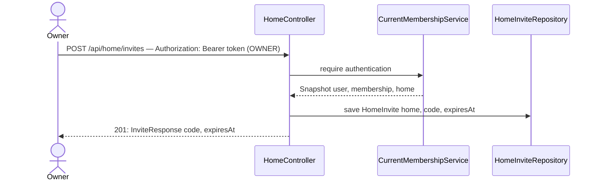

# Invite generation

## What it does

Adds `POST /api/home/invites` so an OWNER can generate a short-lived invite code that a new user can supply to `POST /api/auth/register` (slice 08) to join the household as a VIEWER.

This slice also migrates `HomeController` from `/home` to `/api/home` so it falls under the `/api/**` CORS and security rules configured in slice 01, and refactors it to use `CurrentMembershipService` (slice 04) instead of the manual three-step repository lookup it duplicates today.

## Why

Invite codes are the only mechanism that controls who can join a household. Without them the join path in `RegistrationService` could never be exercised — the `home_invites` table introduced in slice 08 would remain permanently empty.

The code is 6 characters drawn from an unambiguous alphabet (no `0`/`O` or `1`/`I`) generated by `SecureRandom`, giving 32⁶ ≈ 1 billion combinations, which is more than adequate for household-scale use. The 24-hour expiry limits the window if a code leaks. Both are easy to change later.

`HomeController` is refactored in the same slice (rather than a dedicated cleanup slice) because we are already touching the file to add the new method. Leaving the old manual lookup pattern next to a new method that uses `CurrentMembershipService` would be confusing.

## Data flow




## Today → after

**Today** in `[HomeController.java](../../src/main/java/com/glpalma/HomeTreasury/home/HomeController.java)`:

- Mapped to `/home` (outside the `/api/**` prefix, so CORS headers are not sent for it).
- `PUT /home/idealBalance` does the three-repository lookup (`findByEmail` → `findByUser` → `getHome()`) manually, duplicating what `CurrentMembershipService` provides.
- `@PreAuthorize("hasRole('OWNER')")` is present but silently ignored until slice 01 adds `@EnableMethodSecurity`.
- Injects `AppUserRepository`, `HomeMembershipRepository`, `HomeRepository` directly.

**After:** moved to `/api/home`; injects `CurrentMembershipService`, `HomeRepository`, and `HomeInviteRepository`; `AppUserRepository` and `HomeMembershipRepository` injections are removed; `POST /api/home/invites` is added.

## Exact changes

Files ordered: response DTO → controller.

- [x] **New** `[src/main/java/com/glpalma/HomeTreasury/home/InviteResponse.java](../../src/main/java/com/glpalma/HomeTreasury/home/InviteResponse.java)` — response DTO returned by `POST /api/home/invites`; `expiresAt` lets the SPA show the user how long the code is valid
  ```java
  package com.glpalma.HomeTreasury.home;

  import java.time.Instant;

  public record InviteResponse(String code, Instant expiresAt) {
  }
  ```

- [x] **Edit** `[src/main/java/com/glpalma/HomeTreasury/home/HomeController.java](../../src/main/java/com/glpalma/HomeTreasury/home/HomeController.java)` — move to `/api/home`, replace manual repo lookups with `CurrentMembershipService`, add `POST /api/home/invites`
  ```java
  package com.glpalma.HomeTreasury.home;

  import com.glpalma.HomeTreasury.user.CurrentMembershipService;
  import org.springframework.http.HttpStatus;
  import org.springframework.security.access.prepost.PreAuthorize;
  import org.springframework.security.core.Authentication;
  import org.springframework.web.bind.annotation.*;

  import java.security.SecureRandom;
  import java.time.Instant;
  import java.time.temporal.ChronoUnit;

  @RestController
  @RequestMapping("/api/home")
  public class HomeController {

      private static final String CODE_ALPHABET = "ABCDEFGHJKLMNPQRSTUVWXYZ23456789";
      private static final int CODE_LENGTH = 6;
      private static final SecureRandom RANDOM = new SecureRandom();

      private final CurrentMembershipService memberships;
      private final HomeRepository homes;
      private final HomeInviteRepository homeInvites;

      public HomeController(
              CurrentMembershipService memberships,
              HomeRepository homes,
              HomeInviteRepository homeInvites
      ) {
          this.memberships = memberships;
          this.homes = homes;
          this.homeInvites = homeInvites;
      }

      @PreAuthorize("hasRole('OWNER')")
      @PutMapping("/idealBalance")
      public void setIdealBalance(
              @RequestBody BalanceRequest request,
              Authentication authentication
      ) {
          Home home = memberships.require(authentication).home();
          home.setIdealBalance(request.idealBalance());
          homes.save(home);
      }

      @PreAuthorize("hasRole('OWNER')")
      @PostMapping("/invites")
      @ResponseStatus(HttpStatus.CREATED)
      public InviteResponse createInvite(Authentication authentication) {
          Home home = memberships.require(authentication).home();
          String code = generateCode();
          Instant expiresAt = Instant.now().plus(24, ChronoUnit.HOURS);
          homeInvites.save(new HomeInvite(home, code, expiresAt));
          return new InviteResponse(code, expiresAt);
      }

      private static String generateCode() {
          StringBuilder sb = new StringBuilder(CODE_LENGTH);
          for (int i = 0; i < CODE_LENGTH; i++) {
              sb.append(CODE_ALPHABET.charAt(RANDOM.nextInt(CODE_ALPHABET.length())));
          }
          return sb.toString();
      }
  }
  ```


## Verify

1. Register an OWNER (slice 08 must be implemented): save the returned `token` as `$OWNER_TOKEN`.
2. Generate an invite:
  ```
   curl -i -X POST http://localhost:8080/api/home/invites \
     -H "Authorization: Bearer $OWNER_TOKEN"
  ```
3. Expect `201 Created` with body:
  ```json
   { "code": "XK94TZ", "expiresAt": "2026-09-22T21:50:00Z" }
  ```
   Save the `code` as `$CODE`.
4. Register a second user using the code:
  ```
   curl -i -X POST http://localhost:8080/api/auth/register \
     -H "Content-Type: application/json" \
     -d '{"email":"viewer@example.com","password":"password123","inviteCode":"'"$CODE"'"}'
  ```
5. Expect `201 Created` with `"role": "VIEWER"`.
6. Reuse the same code immediately:
  ```
   curl -i -X POST http://localhost:8080/api/auth/register \
     -H "Content-Type: application/json" \
     -d '{"email":"another@example.com","password":"password123","inviteCode":"'"$CODE"'"}'
  ```
7. Expect `400 Bad Request` (code is marked used after first join).
8. Attempt invite generation as a VIEWER: use `$VIEWER_TOKEN` from step 5.
  ```
   curl -i -X POST http://localhost:8080/api/home/invites \
     -H "Authorization: Bearer $VIEWER_TOKEN"
  ```
9. Expect `403 Forbidden`.
10. Confirm the old path no longer works:
  ```
    curl -i -X POST http://localhost:8080/home/invites \
      -H "Authorization: Bearer $OWNER_TOKEN"
  ```
11. Expect `404 Not Found`.


## Out of scope

- Listing or revoking active invites (`GET /api/home/invites`, `DELETE /api/home/invites/{code}`).
- Configurable expiry duration — 24 hours is hardcoded; changing it requires a code edit.
- Code collision handling — if two codes collide (probability ≈ 10⁻⁹ per generation), the `save` throws a `DataIntegrityViolationException`. Retrying on collision is a future improvement.
- Testing `HomeController` in an integration test — it is exercised end-to-end through the verify steps above; a dedicated `HomeControllerTest` is a future addition.

