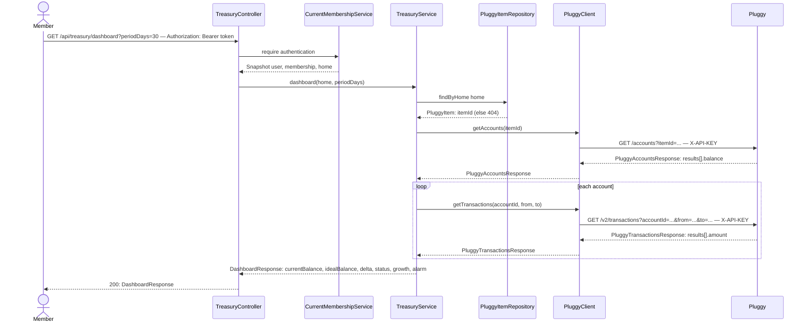

# Treasury dashboard

**Prerequisite:** `pluggy-connection/02-link-item.md` must be implemented first — this slice reads the `PluggyItem` it creates. This is one functionality (one request path), so per the vertical-slice-plans skill it's a standalone slice doc, not its own epic.

## What it does

Returns one dashboard-shaped summary for the current Home: current bank balance, the ideal balance target, the delta between them, and a growth rate computed from recent transactions — everything the SPA's dashboard page needs in a single call.

## Why

The SPA dashboard needs a stable, English-shaped view of Pluggy data, not Pluggy's raw response wrapper. Today's `TreasuryController` (`GET /saldo`, `GET /extrato`, `GET /ping-pluggy`) predates Homes entirely: it reads a single hardcoded `pluggy.item-id` from config, ignores the current user's Home, and returns Pluggy's DTOs (`{ results: [...] }`) directly. None of that composes into "is this Home above or below its target, and by how much."

This is a **live proxy**, not a sync: every call re-fetches accounts and transactions from Pluggy. There is no local `Account`/`Transaction` table. That's a deliberate v1 simplification — it means growth is always computed from Pluggy's live data (no staleness), at the cost of one dashboard load costing `1 + N` Pluggy calls (`N` = account count). Revisit if that latency or Pluggy's rate limits become a problem.

`idealBalance` already lives on `Home` (`home/Home.java`). `status`/`alarm` are two views of the same number (`delta = currentBalance - idealBalance`) so the SPA doesn't have to re-derive the alarm boolean from the numeric delta itself. `growth.rate` is normalized by the *opening* balance (`currentBalance - netChange`, floored at an epsilon) rather than `idealBalance`, because a home tracking toward a small ideal balance shouldn't get an exaggerated growth percentage.

## Data flow



## Today → after

**Today** in [`TreasuryController.java`](../src/main/java/com/glpalma/HomeTreasury/treasury/TreasuryController.java): three unauthenticated-in-spirit diagnostic routes at the root (`/ping-pluggy`, `/saldo`, `/extrato`), all injecting `PluggyClient` directly and returning Pluggy's DTOs unshaped. `/extrato` silently falls back to the item's first account and throws an unmapped `IllegalStateException` if there are none.

**Today** in [`PluggyClient.java`](src/main/java/com/glpalma/HomeTreasury/pluggy/PluggyClient.java) (after `pluggy-connection` is implemented): `getAccounts()` takes no argument and reads the global `properties.itemId()`; `getTransactions(accountId)` takes no date range.

**Today** in [`PluggyProperties.java`](../src/main/java/com/glpalma/HomeTreasury/config/PluggyProperties.java): `record PluggyProperties(String clientId, String clientSecret, String itemId)`.

**After:** `TreasuryController` drops all three old routes and adds `GET /api/treasury/dashboard`, delegating to a new `TreasuryService`. `PluggyClient.getAccounts` takes an explicit `itemId` (the Home's, not a global one) and `getTransactions` takes an optional date range. `PluggyProperties` drops `itemId` — nothing reads it anymore once this slice ships.

## Exact changes

Files ordered: enum → response DTO → client → service → controller → properties/config cleanup.

- [ ] **New** [`src/main/java/com/glpalma/HomeTreasury/treasury/HealthStatus.java`](../src/main/java/com/glpalma/HomeTreasury/treasury/HealthStatus.java)
  ```java
  package com.glpalma.HomeTreasury.treasury;

  public enum HealthStatus {
      ABOVE,
      AT,
      BELOW
  }
  ```

- [ ] **New** [`src/main/java/com/glpalma/HomeTreasury/treasury/DashboardResponse.java`](../src/main/java/com/glpalma/HomeTreasury/treasury/DashboardResponse.java)
  ```java
  package com.glpalma.HomeTreasury.treasury;

  import java.math.BigDecimal;

  public record DashboardResponse(
          BigDecimal currentBalance,
          BigDecimal idealBalance,
          BigDecimal delta,
          HealthStatus status,
          Growth growth,
          Alarm alarm
  ) {
      public record Growth(int periodDays, BigDecimal netChange, BigDecimal rate) {
      }

      public record Alarm(boolean underBalance) {
      }
  }
  ```

- [ ] **Edit** [`src/main/java/com/glpalma/HomeTreasury/pluggy/PluggyClient.java`](../src/main/java/com/glpalma/HomeTreasury/pluggy/PluggyClient.java) — `getAccounts` takes `itemId`; `getTransactions` takes an optional date range; both stop reading `properties.itemId()`
  ```java
  package com.glpalma.HomeTreasury.pluggy;

  import com.glpalma.HomeTreasury.config.PluggyProperties;
  import org.springframework.stereotype.Component;
  import org.springframework.web.client.RestClient;

  import java.time.Duration;
  import java.time.Instant;
  import java.time.LocalDate;
  import java.util.Map;

  @Component
  public class PluggyClient {

      private static final Duration API_KEY_TTL = Duration.ofMinutes(110);

      private final RestClient restClient;
      private final PluggyProperties properties;

      private volatile String cachedApiKey;
      private volatile Instant cachedApiKeyExpiresAt = Instant.EPOCH;

      public PluggyClient(RestClient pluggyRestClient, PluggyProperties properties) {
          this.restClient = pluggyRestClient;
          this.properties = properties;
      }

      private RestClient.RequestHeadersSpec<?> authorizedGet(String uri) {
          return restClient.get()
                  .uri(uri)
                  .header("X-API-KEY", getApiKey());
      }

      private RestClient.RequestBodySpec authorizedPost(String uri) {
          return restClient.post()
                  .uri(uri)
                  .header("X-API-KEY", getApiKey());
      }

      public synchronized String getApiKey() {
          if (cachedApiKey != null && Instant.now().isBefore(cachedApiKeyExpiresAt)) {
              return cachedApiKey;
          }
          PluggyAuthResponse response = restClient.post()
                  .uri("/auth")
                  .body(Map.of(
                          "clientId", properties.clientId(),
                          "clientSecret", properties.clientSecret()
                  ))
                  .retrieve()
                  .body(PluggyAuthResponse.class);
          if (response == null || response.apiKey() == null) {
              throw new IllegalStateException("Pluggy auth returned empty apiKey");
          }
          cachedApiKey = response.apiKey();
          cachedApiKeyExpiresAt = Instant.now().plus(API_KEY_TTL);
          return cachedApiKey;
      }

      public PluggyConnectTokenResponse getConnectToken() {
          return authorizedPost("/connect_token")
                  .body(Map.of())
                  .retrieve()
                  .body(PluggyConnectTokenResponse.class);
      }

      public PluggyItemDetails getItem(String itemId) {
          return authorizedGet("/items/" + itemId)
                  .retrieve()
                  .body(PluggyItemDetails.class);
      }

      public PluggyAccountsResponse getAccounts(String itemId) {
          return authorizedGet("/accounts?itemId=" + itemId)
                  .retrieve()
                  .body(PluggyAccountsResponse.class);
      }

      public PluggyTransactionsResponse getTransactions(String accountId, LocalDate from, LocalDate to) {
          return restClient.get()
                  .uri(uriBuilder -> {
                      uriBuilder.path("/v2/transactions").queryParam("accountId", accountId);
                      if (from != null) {
                          uriBuilder.queryParam("from", from.toString());
                      }
                      if (to != null) {
                          uriBuilder.queryParam("to", to.toString());
                      }
                      return uriBuilder.build();
                  })
                  .header("X-API-KEY", getApiKey())
                  .retrieve()
                  .body(PluggyTransactionsResponse.class);
      }
  }
  ```

- [ ] **New** [`src/main/java/com/glpalma/HomeTreasury/treasury/TreasuryService.java`](../src/main/java/com/glpalma/HomeTreasury/treasury/TreasuryService.java)
  ```java
  package com.glpalma.HomeTreasury.treasury;

  import com.glpalma.HomeTreasury.home.Home;
  import com.glpalma.HomeTreasury.home.PluggyItem;
  import com.glpalma.HomeTreasury.home.PluggyItemRepository;
  import com.glpalma.HomeTreasury.pluggy.PluggyAccount;
  import com.glpalma.HomeTreasury.pluggy.PluggyClient;
  import com.glpalma.HomeTreasury.pluggy.PluggyTransaction;
  import org.springframework.http.HttpStatus;
  import org.springframework.stereotype.Service;
  import org.springframework.web.server.ResponseStatusException;

  import java.math.BigDecimal;
  import java.math.RoundingMode;
  import java.time.LocalDate;
  import java.util.List;

  @Service
  public class TreasuryService {

      private static final BigDecimal EPSILON = new BigDecimal("0.01");

      private final PluggyClient pluggyClient;
      private final PluggyItemRepository pluggyItems;

      public TreasuryService(PluggyClient pluggyClient, PluggyItemRepository pluggyItems) {
          this.pluggyClient = pluggyClient;
          this.pluggyItems = pluggyItems;
      }

      public DashboardResponse dashboard(Home home, int periodDays) {
          PluggyItem item = pluggyItems.findByHome(home)
                  .orElseThrow(() -> new ResponseStatusException(
                          HttpStatus.NOT_FOUND, "No Pluggy item linked to this home"));

          List<PluggyAccount> accounts = accountsOrEmpty(item.getItemId());
          BigDecimal current = accounts.stream()
                  .map(a -> a.balance() == null ? BigDecimal.ZERO : a.balance())
                  .reduce(BigDecimal.ZERO, BigDecimal::add);

          BigDecimal ideal = home.getIdealBalance() == null ? BigDecimal.ZERO : home.getIdealBalance();
          BigDecimal delta = current.subtract(ideal);
          HealthStatus status = delta.signum() < 0 ? HealthStatus.BELOW
                  : delta.signum() == 0 ? HealthStatus.AT
                  : HealthStatus.ABOVE;

          LocalDate to = LocalDate.now();
          LocalDate from = to.minusDays(periodDays);
          BigDecimal netChange = BigDecimal.ZERO;
          for (PluggyAccount account : accounts) {
              for (PluggyTransaction tx : transactionsOrEmpty(account.id(), from, to)) {
                  if (tx.amount() != null) {
                      netChange = netChange.add(tx.amount());
                  }
              }
          }
          BigDecimal opening = current.subtract(netChange).abs().max(EPSILON);
          BigDecimal rate = netChange.divide(opening, 4, RoundingMode.HALF_UP);

          return new DashboardResponse(
                  current,
                  ideal,
                  delta,
                  status,
                  new DashboardResponse.Growth(periodDays, netChange, rate),
                  new DashboardResponse.Alarm(status == HealthStatus.BELOW)
          );
      }

      private List<PluggyAccount> accountsOrEmpty(String itemId) {
          var results = pluggyClient.getAccounts(itemId).results();
          return results == null ? List.of() : results;
      }

      private List<PluggyTransaction> transactionsOrEmpty(String accountId, LocalDate from, LocalDate to) {
          var results = pluggyClient.getTransactions(accountId, from, to).results();
          return results == null ? List.of() : results;
      }
  }
  ```

- [ ] **Edit** [`src/main/java/com/glpalma/HomeTreasury/treasury/TreasuryController.java`](../src/main/java/com/glpalma/HomeTreasury/treasury/TreasuryController.java) — replace the whole class; drops `pingPluggy`/`saldo`/`extrato`, no longer injects `PluggyClient` directly
  ```java
  package com.glpalma.HomeTreasury.treasury;

  import com.glpalma.HomeTreasury.user.CurrentMembershipService;
  import org.springframework.security.core.Authentication;
  import org.springframework.web.bind.annotation.GetMapping;
  import org.springframework.web.bind.annotation.RequestMapping;
  import org.springframework.web.bind.annotation.RequestParam;
  import org.springframework.web.bind.annotation.RestController;

  @RestController
  @RequestMapping("/api/treasury")
  public class TreasuryController {

      private final TreasuryService treasuryService;
      private final CurrentMembershipService memberships;

      public TreasuryController(TreasuryService treasuryService, CurrentMembershipService memberships) {
          this.treasuryService = treasuryService;
          this.memberships = memberships;
      }

      @GetMapping("/dashboard")
      public DashboardResponse dashboard(
              @RequestParam(defaultValue = "30") int periodDays,
              Authentication authentication
      ) {
          var home = memberships.require(authentication).home();
          return treasuryService.dashboard(home, periodDays);
      }
  }
  ```

- [ ] **Edit** [`src/main/java/com/glpalma/HomeTreasury/config/PluggyProperties.java`](../src/main/java/com/glpalma/HomeTreasury/config/PluggyProperties.java) — drop `itemId`, nothing reads it anymore
  ```java
  package com.glpalma.HomeTreasury.config;

  import org.springframework.boot.context.properties.ConfigurationProperties;

  @ConfigurationProperties(prefix = "pluggy")
  public record PluggyProperties(String clientId, String clientSecret) {
  }
  ```

- [ ] **Edit** [`src/main/resources/application.properties`](../src/main/resources/application.properties) — remove `pluggy.item-id`
  ```properties
  spring.application.name=HomeTreasury
  pluggy.client-id=${PLUGGY_CLIENT_ID}
  pluggy.client-secret=${PLUGGY_CLIENT_SECRET}

  spring.datasource.url=${DB_URL}
  spring.datasource.username=${DB_USER}
  spring.datasource.password=${DB_PASSWORD}
  spring.jpa.hibernate.ddl-auto=update
  spring.jpa.show-sql=true

  jwt.secret=${JWT_SECRET}
  jwt.expiration-ms=${JWT_EXPIRATION_MS}

  app.cors.allowed-origins=http://localhost:5173
  ```

- [ ] **Edit** [`src/test/resources/application.properties`](../src/test/resources/application.properties) — remove `pluggy.item-id`
  ```properties
  spring.datasource.url=jdbc:h2:mem:testdb
  spring.datasource.driver-class-name=org.h2.Driver
  spring.datasource.username=sa
  spring.datasource.password=
  spring.jpa.hibernate.ddl-auto=create-drop

  pluggy.client-id=test-client-id
  pluggy.client-secret=test-client-secret

  jwt.secret=test-jwt-secret-must-be-at-least-32-chars-long
  jwt.expiration-ms=3600000

  app.cors.allowed-origins=http://localhost:5173
  ```

## Verify

1. Complete `pluggy-connection` slices 01–02 so the current Home has a linked Pluggy Item with at least one account holding a real balance.
2. Set the Home's ideal balance (existing `PUT /home/idealBalance`, OWNER only) to something below the current bank balance:
   ```
   curl -i -X PUT http://localhost:8080/home/idealBalance \
     -H "Authorization: Bearer $OWNER_TOKEN" \
     -H "Content-Type: application/json" \
     -d '{"idealBalance": 100.00}'
   ```
3. Call the dashboard:
   ```
   curl -i "http://localhost:8080/api/treasury/dashboard?periodDays=30" \
     -H "Authorization: Bearer $OWNER_TOKEN"
   ```
4. Expect `200 OK`, `status: "ABOVE"`, `alarm.underBalance: false`, and `delta` equal to `currentBalance - idealBalance`.
5. Raise `idealBalance` above the current bank balance via the same `PUT`, repeat step 3. Expect `status: "BELOW"` and `alarm.underBalance: true`.
6. Call the dashboard for a Home with no linked Pluggy Item. Expect `404 Not Found`, `"No Pluggy item linked to this home"`.
7. Confirm the old routes are gone:
   ```
   curl -i http://localhost:8080/saldo -H "Authorization: Bearer $OWNER_TOKEN"
   ```
8. Expect `404 Not Found`.

## Out of scope

- `GET /api/treasury/accounts` / `GET /api/treasury/transactions` as their own endpoints — deferred until the dashboard alone proves insufficient (see this repo's earlier, superseded `treasury-dashboard-api.md` draft for that shape if/when it's picked back up).
- Spending-by-category breakdown and balance-over-time chart series — both need either persisted history or many more Pluggy calls; out of scope for the live-proxy v1.
- Pagination across transaction pages within `periodDays` — `getTransactions` takes Pluggy's default page size; an account with more transactions than one page in the period will undercount `netChange`. Acceptable for v1, worth revisiting if it causes visibly wrong growth numbers.
- Caching the dashboard response — every call re-hits Pluggy for every account.
