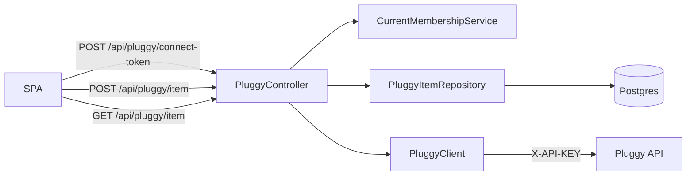

# Pluggy Connection

## Problem

Today `PluggyClient.getAccounts()`/`getTransactions()` talk to a single bank connection: `pluggy.item-id`, a hardcoded env var shared by the whole server. That matched the old single-Home, single-owner model. Now that registration (the `auth-and-login` epic) lets any number of Homes sign up, each Home needs to connect **its own** bank account through Pluggy's hosted Connect widget, and HomeTreasury needs to remember which Pluggy `itemId` belongs to which Home.

This epic builds that connection lifecycle end to end: issuing a Connect Token for the widget, persisting the `itemId` the widget hands back, and letting the SPA show whether a Home is connected yet. It deliberately stops there — it does not fetch balances or transactions. That consumption is [`treasury-dashboard.md`](../treasury-dashboard.md), a separate, dependent piece of work.

## Domain terms

- **Pluggy Item** (Java type `PluggyItem`, table `pluggy_items`): the persisted record of a Home's bank connection — Pluggy's `itemId`, the connector name, and when it was linked. One Home has **at most one** Pluggy Item in v1 (see "Out of scope").
  _Avoid_: bare "Item" for the entity — CONTEXT.md's existing "Item" term is Pluggy's own concept; "Pluggy Item" is HomeTreasury's persisted record of one.
- **Connect Token**: a short-lived, single-use token Pluggy issues via `POST /connect_token` (authenticated with the Api Key). The SPA feeds it into the Pluggy Connect widget so the bank credentials never touch HomeTreasury's backend.
  _Avoid_: confusing with the Api Key — the Connect Token is scoped to one widget session; the Api Key authorizes every other Pluggy call.
- **Api Key**: the credential returned by `POST /auth` (`X-API-KEY` header on every other Pluggy call). Expires ~2h; slice 01 adds caching so `PluggyClient` doesn't re-authenticate on every call.
- **Connector**: Pluggy's identifier for the financial institution being connected (e.g. "Nubank"). Only surfaced for display in this epic; not its own entity.

## System data flow

## Slices

1. **[Connect Token issuance](01-connect-token.md)** — `POST /api/pluggy/connect-token`. Adds Api Key caching to `PluggyClient` (this is the first slice to add a second Pluggy call type, so it's the natural place) and a `getConnectToken()` method. OWNER-only. No DB entity, no dependency on the other two slices.
2. **[Link a Pluggy Item to my Home](02-link-item.md)** — `POST /api/pluggy/item`. Introduces the `PluggyItem` entity/repository, validates the `itemId` against Pluggy's `GET /items/{id}`, and persists it. Needs slice 01's cached-Api-Key `PluggyClient` (adds `getItem`) — ordered after it so both edits land on the same `PluggyClient` shape instead of conflicting.
3. **[View my Home's Pluggy connection](03-connection-status.md)** — `GET /api/pluggy/item`. Returns the connector name + linked date, or 404 if nothing is linked yet. Needs slice 02's `PluggyItem` entity to query — nothing to show before something can be linked.

## Out of scope (epic-wide)

- Disconnecting or replacing a linked Pluggy Item — `POST /api/pluggy/item` returns `409 Conflict` if the Home already has one; there is no delete path yet.
- Webhook handling for Item status changes (`LOGIN_ERROR`, `OUTDATED`, MFA prompts). The status returned by slice 02/03 is whatever Pluggy reported at link time; it is not kept fresh.
- More than one Pluggy Item per Home (multiple banks / accounts at different institutions).
- Investments, credit card bills, identity/KYC data — this epic only validates and stores the `itemId`; fetching what's inside it is `treasury-dashboard.md`.
- A dedicated test slice (mirroring `auth-and-login/07-tests.md`) — each slice below has curl-based verify steps instead; add `PluggyControllerTest` as a follow-up once the shape is stable.
