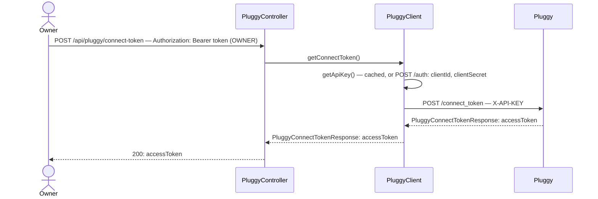

# Connect Token issuance

## What it does

Lets an OWNER request a Pluggy Connect Token so the SPA can open the Pluggy Connect widget and let the user securely enter their bank credentials, without HomeTreasury ever seeing them.

## Why

Pluggy Connect is a hosted widget: the frontend needs a short-lived Connect Token to open it, but issuing that token requires the Api Key (`clientId`/`clientSecret`), which must never reach the browser. This endpoint is the one place that secret is used to mint something safe to hand to the SPA.

`PluggyClient.getApiKey()` today calls `POST /auth` on every single Pluggy call — it's about to gain a second caller (`getConnectToken()`, and later `getItem()` in slice 02), so this is the right point to cache it instead of tripling the number of `/auth` round-trips for no reason. The 110-minute TTL leaves a 10-minute buffer under Pluggy's ~2h expiry.

Only an OWNER can request a Connect Token because connecting a bank account is a Home-level decision, matching the existing `@PreAuthorize("hasRole('OWNER')")` pattern used for `PUT /home/idealBalance`.

## Data flow



## Today → after

**Today** in [`PluggyClient.java`](../../src/main/java/com/glpalma/HomeTreasury/pluggy/PluggyClient.java): `getApiKey()` is `public`, has no caching, and calls `POST /auth` on every invocation — including once per `getAccounts()`/`getTransactions()` call. There is no `PluggyController`; Pluggy is only reached via `TreasuryController`.

**After:** `getApiKey()` becomes `synchronized` and cached with a TTL. A new `authorizedPost` helper mirrors the existing `authorizedGet`. `getAccounts()`/`getTransactions()` are untouched — this slice only adds capability, it doesn't change existing behavior.

## Exact changes

Files ordered: raw Pluggy DTO → client → controller.

- [x] **New** [`src/main/java/com/glpalma/HomeTreasury/pluggy/PluggyConnectTokenResponse.java`](../../src/main/java/com/glpalma/HomeTreasury/pluggy/PluggyConnectTokenResponse.java) — Pluggy's `/connect_token` response shape; returned to the SPA as-is since `accessToken` is exactly the field name the Pluggy Connect widget SDK expects
  ```java
  package com.glpalma.HomeTreasury.pluggy;

  public record PluggyConnectTokenResponse(String accessToken) {
  }
  ```

- [x] **Edit** [`src/main/java/com/glpalma/HomeTreasury/pluggy/PluggyClient.java`](../../src/main/java/com/glpalma/HomeTreasury/pluggy/PluggyClient.java) — cache the Api Key, add `authorizedPost` and `getConnectToken()`
  ```java
  package com.glpalma.HomeTreasury.pluggy;

  import com.glpalma.HomeTreasury.config.PluggyProperties;
  import org.springframework.stereotype.Component;
  import org.springframework.web.client.RestClient;

  import java.time.Duration;
  import java.time.Instant;
  import java.util.Map;

  @Component
  public class PluggyClient {

      private static final Duration API_KEY_TTL = Duration.ofMinutes(110);

      private final RestClient restClient;
      private final PluggyProperties properties;

      private volatile String cachedApiKey;
      private volatile Instant cachedApiKeyExpiresAt = Instant.EPOCH;

      public PluggyClient(RestClient pluggyRestClient, PluggyProperties properties) {
          this.restClient = pluggyRestClient;
          this.properties = properties;
      }

      private RestClient.RequestHeadersSpec<?> authorizedGet(String uri) {
          return restClient.get()
                  .uri(uri)
                  .header("X-API-KEY", getApiKey());
      }

      private RestClient.RequestBodySpec authorizedPost(String uri) {
          return restClient.post()
                  .uri(uri)
                  .header("X-API-KEY", getApiKey());
      }

      public synchronized String getApiKey() {
          if (cachedApiKey != null && Instant.now().isBefore(cachedApiKeyExpiresAt)) {
              return cachedApiKey;
          }
          PluggyAuthResponse response = restClient.post()
                  .uri("/auth")
                  .body(Map.of(
                          "clientId", properties.clientId(),
                          "clientSecret", properties.clientSecret()
                  ))
                  .retrieve()
                  .body(PluggyAuthResponse.class);
          if (response == null || response.apiKey() == null) {
              throw new IllegalStateException("Pluggy auth returned empty apiKey");
          }
          cachedApiKey = response.apiKey();
          cachedApiKeyExpiresAt = Instant.now().plus(API_KEY_TTL);
          return cachedApiKey;
      }

      public PluggyConnectTokenResponse getConnectToken() {
          return authorizedPost("/connect_token")
                  .body(Map.of())
                  .retrieve()
                  .body(PluggyConnectTokenResponse.class);
      }

      public PluggyAccountsResponse getAccounts() {
          return authorizedGet("/accounts?itemId=" + properties.itemId())
                  .retrieve()
                  .body(PluggyAccountsResponse.class);
      }

      public PluggyTransactionsResponse getTransactions(String accountId) {
          return authorizedGet("/v2/transactions?accountId=" + accountId)
                  .retrieve()
                  .body(PluggyTransactionsResponse.class);
      }
  }
  ```

- [x] **New** [`src/main/java/com/glpalma/HomeTreasury/pluggy/PluggyController.java`](../../src/main/java/com/glpalma/HomeTreasury/pluggy/PluggyController.java) — slices 02 and 03 add methods to this same class
  ```java
  package com.glpalma.HomeTreasury.pluggy;

  import org.springframework.security.access.prepost.PreAuthorize;
  import org.springframework.web.bind.annotation.PostMapping;
  import org.springframework.web.bind.annotation.RequestMapping;
  import org.springframework.web.bind.annotation.RestController;

  @RestController
  @RequestMapping("/api/pluggy")
  public class PluggyController {

      private final PluggyClient pluggyClient;

      public PluggyController(PluggyClient pluggyClient) {
          this.pluggyClient = pluggyClient;
      }

      @PreAuthorize("hasRole('OWNER')")
      @PostMapping("/connect-token")
      public PluggyConnectTokenResponse connectToken() {
          return pluggyClient.getConnectToken();
      }
  }
  ```

## Verify

1. Obtain an OWNER token from `POST /api/auth/login` or `POST /api/auth/register`, save as `$OWNER_TOKEN`.
2. Request a Connect Token:
   ```
   curl -i -X POST http://localhost:8080/api/pluggy/connect-token \
     -H "Authorization: Bearer $OWNER_TOKEN"
   ```
3. Expect `200 OK` with body:
   ```json
   { "accessToken": "<pluggy-connect-token>" }
   ```
4. Register/login a second user who joined via invite (VIEWER role — see `auth-and-login`), save as `$VIEWER_TOKEN`. Attempt the same request:
   ```
   curl -i -X POST http://localhost:8080/api/pluggy/connect-token \
     -H "Authorization: Bearer $VIEWER_TOKEN"
   ```
5. Expect `403 Forbidden`.
6. Call twice in a row within a couple of minutes and confirm both succeed quickly — the second call should not add a visible delay from a fresh `/auth` round-trip (cache hit). This is a manual sanity check, not an automated assertion.

## Out of scope

- Anything the widget does after receiving this token (opening it, letting the user pick a bank, entering credentials) — pure frontend, not part of this backend epic.
- Persisting anything about this call — a Connect Token is stateless from the backend's point of view; nothing is written to the DB until slice 02.
- Passing `itemId` to `/connect_token` for a reconnect/update flow — out of scope until disconnect/reconnect exists.
