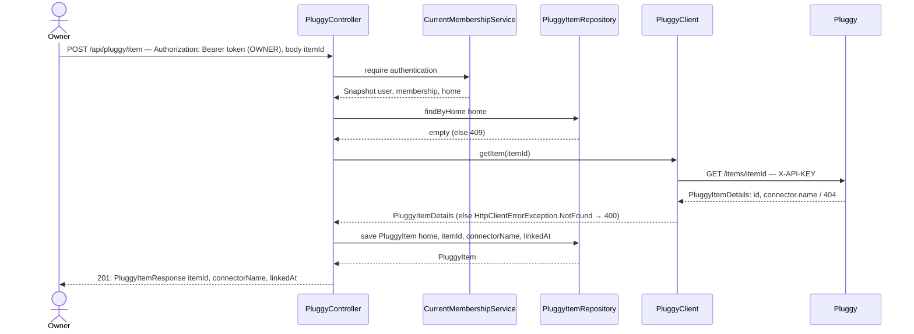

# Link a Pluggy Item to my Home

## What it does

Lets an OWNER tell HomeTreasury which Pluggy `itemId` (returned by the Connect widget after slice 01's token was used) belongs to their Home, so future balance/transaction lookups know which bank connection to use.

## Why

The widget flow is entirely client-side: Pluggy hands the `itemId` to the SPA, not to HomeTreasury. This endpoint is the only place that `itemId` becomes durable — without it, `PluggyItem` would exist as an entity with no way to ever get a row.

The `itemId` is validated against Pluggy's `GET /items/{id}` (`PluggyClient.getItem`) rather than trusted as opaque input, for two reasons: it confirms the id actually exists (a typo or a stale id from a failed widget session shouldn't silently create a bad row), and it's the only way to get the connector name to store for display — Pluggy's Connect widget callback returns the `itemId` but not a display-ready institution name.

One Home, one Pluggy Item in v1 (see epic overview) — this endpoint returns `409 Conflict` if the Home already has one, rather than silently overwriting it. Overwriting would strand the previous bank's data with no path to reconnect it later.

## Data flow




## Today → after

**Today** in `[PluggyController.java](../../src/main/java/com/glpalma/HomeTreasury/pluggy/PluggyController.java)` (slice 01): only `connectToken()`; constructor takes just `PluggyClient`. In `[PluggyClient.java](../../src/main/java/com/glpalma/HomeTreasury/pluggy/PluggyClient.java)` (slice 01): no `getItem` method. There is no `PluggyItem` entity — nothing links a Home to a bank connection except the global `pluggy.item-id` property, which this epic does not remove yet (the dashboard slice does, since that's the consumer switching call sites).

**After:** `PluggyController` gains `CurrentMembershipService` and `PluggyItemRepository` dependencies and a `linkItem` method. `PluggyClient` gains `getItem(String itemId)`.

## Exact changes

Files ordered: entity → repository → raw Pluggy DTO → request/response DTOs → client → controller.

- [x] **New** `[src/main/java/com/glpalma/HomeTreasury/home/PluggyItem.java](../../src/main/java/com/glpalma/HomeTreasury/home/PluggyItem.java)` — placed in `home` because it belongs to exactly one Home, same reasoning as `HomeInvite`
  ```java
  package com.glpalma.HomeTreasury.home;

  import jakarta.persistence.*;

  import java.time.Instant;

  @Entity
  @Table(name = "pluggy_items")
  public class PluggyItem {

      @Id
      @GeneratedValue(strategy = GenerationType.IDENTITY)
      private Long id;

      @OneToOne(optional = false)
      @JoinColumn(name = "home_id", unique = true)
      private Home home;

      @Column(nullable = false, unique = true)
      private String itemId;

      private String connectorName;

      @Column(nullable = false)
      private Instant linkedAt;

      protected PluggyItem() {
      }

      public PluggyItem(Home home, String itemId, String connectorName, Instant linkedAt) {
          this.home = home;
          this.itemId = itemId;
          this.connectorName = connectorName;
          this.linkedAt = linkedAt;
      }

      public Long getId() {
          return id;
      }

      public Home getHome() {
          return home;
      }

      public String getItemId() {
          return itemId;
      }

      public String getConnectorName() {
          return connectorName;
      }

      public Instant getLinkedAt() {
          return linkedAt;
      }
  }
  ```

- [x] **New** `[src/main/java/com/glpalma/HomeTreasury/home/PluggyItemRepository.java](../../src/main/java/com/glpalma/HomeTreasury/home/PluggyItemRepository.java)`
  ```java
  package com.glpalma.HomeTreasury.home;

  import org.springframework.data.jpa.repository.JpaRepository;

  import java.util.Optional;

  public interface PluggyItemRepository extends JpaRepository<PluggyItem, Long> {

      Optional<PluggyItem> findByHome(Home home);
  }
  ```

- [x] **New** `[src/main/java/com/glpalma/HomeTreasury/pluggy/PluggyItemDetails.java](../../src/main/java/com/glpalma/HomeTreasury/pluggy/PluggyItemDetails.java)` — raw shape of Pluggy's `GET /items/{id}` response, trimmed to the fields this slice needs; named `Details` (not `PluggyItem`) to avoid confusion with the JPA entity in `home`
  ```java
  package com.glpalma.HomeTreasury.pluggy;

  public record PluggyItemDetails(String id, Connector connector, String status) {

      public record Connector(String name) {
      }
  }
  ```

- [x] **New** `[src/main/java/com/glpalma/HomeTreasury/pluggy/LinkPluggyItemRequest.java](../../src/main/java/com/glpalma/HomeTreasury/pluggy/LinkPluggyItemRequest.java)`
  ```java
  package com.glpalma.HomeTreasury.pluggy;

  import jakarta.validation.constraints.NotBlank;

  public record LinkPluggyItemRequest(@NotBlank String itemId) {
  }
  ```

- [x] **New** `[src/main/java/com/glpalma/HomeTreasury/pluggy/PluggyItemResponse.java](../../src/main/java/com/glpalma/HomeTreasury/pluggy/PluggyItemResponse.java)` — reused unchanged by slice 03's `GET`
  ```java
  package com.glpalma.HomeTreasury.pluggy;

  import com.glpalma.HomeTreasury.home.PluggyItem;

  import java.time.Instant;

  public record PluggyItemResponse(String itemId, String connectorName, Instant linkedAt) {

      public static PluggyItemResponse from(PluggyItem item) {
          return new PluggyItemResponse(item.getItemId(), item.getConnectorName(), item.getLinkedAt());
      }
  }
  ```

- [x] **Edit** `[src/main/java/com/glpalma/HomeTreasury/pluggy/PluggyClient.java](../../src/main/java/com/glpalma/HomeTreasury/pluggy/PluggyClient.java)` — add `getItem`
  ```java
  package com.glpalma.HomeTreasury.pluggy;

  import com.glpalma.HomeTreasury.config.PluggyProperties;
  import org.springframework.stereotype.Component;
  import org.springframework.web.client.RestClient;

  import java.time.Duration;
  import java.time.Instant;
  import java.util.Map;

  @Component
  public class PluggyClient {

      private static final Duration API_KEY_TTL = Duration.ofMinutes(110);

      private final RestClient restClient;
      private final PluggyProperties properties;

      private volatile String cachedApiKey;
      private volatile Instant cachedApiKeyExpiresAt = Instant.EPOCH;

      public PluggyClient(RestClient pluggyRestClient, PluggyProperties properties) {
          this.restClient = pluggyRestClient;
          this.properties = properties;
      }

      private RestClient.RequestHeadersSpec<?> authorizedGet(String uri) {
          return restClient.get()
                  .uri(uri)
                  .header("X-API-KEY", getApiKey());
      }

      private RestClient.RequestBodySpec authorizedPost(String uri) {
          return restClient.post()
                  .uri(uri)
                  .header("X-API-KEY", getApiKey());
      }

      public synchronized String getApiKey() {
          if (cachedApiKey != null && Instant.now().isBefore(cachedApiKeyExpiresAt)) {
              return cachedApiKey;
          }
          PluggyAuthResponse response = restClient.post()
                  .uri("/auth")
                  .body(Map.of(
                          "clientId", properties.clientId(),
                          "clientSecret", properties.clientSecret()
                  ))
                  .retrieve()
                  .body(PluggyAuthResponse.class);
          if (response == null || response.apiKey() == null) {
              throw new IllegalStateException("Pluggy auth returned empty apiKey");
          }
          cachedApiKey = response.apiKey();
          cachedApiKeyExpiresAt = Instant.now().plus(API_KEY_TTL);
          return cachedApiKey;
      }

      public PluggyConnectTokenResponse getConnectToken() {
          return authorizedPost("/connect_token")
                  .body(Map.of())
                  .retrieve()
                  .body(PluggyConnectTokenResponse.class);
      }

      public PluggyItemDetails getItem(String itemId) {
          return authorizedGet("/items/" + itemId)
                  .retrieve()
                  .body(PluggyItemDetails.class);
      }

      public PluggyAccountsResponse getAccounts() {
          return authorizedGet("/accounts?itemId=" + properties.itemId())
                  .retrieve()
                  .body(PluggyAccountsResponse.class);
      }

      public PluggyTransactionsResponse getTransactions(String accountId) {
          return authorizedGet("/v2/transactions?accountId=" + accountId)
                  .retrieve()
                  .body(PluggyTransactionsResponse.class);
      }
  }
  ```

- [x] **Edit** `[src/main/java/com/glpalma/HomeTreasury/pluggy/PluggyController.java](../../src/main/java/com/glpalma/HomeTreasury/pluggy/PluggyController.java)` — add `linkItem`; `HttpClientErrorException.NotFound` from `getItem` becomes `400`, an existing link becomes `409`
  ```java
  package com.glpalma.HomeTreasury.pluggy;

  import com.glpalma.HomeTreasury.home.Home;
  import com.glpalma.HomeTreasury.home.PluggyItem;
  import com.glpalma.HomeTreasury.home.PluggyItemRepository;
  import com.glpalma.HomeTreasury.user.CurrentMembershipService;
  import jakarta.validation.Valid;
  import org.springframework.http.HttpStatus;
  import org.springframework.security.access.prepost.PreAuthorize;
  import org.springframework.security.core.Authentication;
  import org.springframework.web.bind.annotation.*;
  import org.springframework.web.client.HttpClientErrorException;
  import org.springframework.web.server.ResponseStatusException;

  import java.time.Instant;

  @RestController
  @RequestMapping("/api/pluggy")
  public class PluggyController {

      private final PluggyClient pluggyClient;
      private final CurrentMembershipService memberships;
      private final PluggyItemRepository pluggyItems;

      public PluggyController(
              PluggyClient pluggyClient,
              CurrentMembershipService memberships,
              PluggyItemRepository pluggyItems
      ) {
          this.pluggyClient = pluggyClient;
          this.memberships = memberships;
          this.pluggyItems = pluggyItems;
      }

      @PreAuthorize("hasRole('OWNER')")
      @PostMapping("/connect-token")
      public PluggyConnectTokenResponse connectToken() {
          return pluggyClient.getConnectToken();
      }

      @PreAuthorize("hasRole('OWNER')")
      @PostMapping("/item")
      @ResponseStatus(HttpStatus.CREATED)
      public PluggyItemResponse linkItem(
              @Valid @RequestBody LinkPluggyItemRequest request,
              Authentication authentication
      ) {
          Home home = memberships.require(authentication).home();
          if (pluggyItems.findByHome(home).isPresent()) {
              throw new ResponseStatusException(HttpStatus.CONFLICT, "Home already has a linked Pluggy item");
          }

          PluggyItemDetails details;
          try {
              details = pluggyClient.getItem(request.itemId());
          } catch (HttpClientErrorException.NotFound ex) {
              throw new ResponseStatusException(HttpStatus.BAD_REQUEST, "Unknown Pluggy item");
          }

          PluggyItem saved = pluggyItems.save(new PluggyItem(
                  home,
                  details.id(),
                  details.connector() == null ? null : details.connector().name(),
                  Instant.now()
          ));
          return PluggyItemResponse.from(saved);
      }
  }
  ```


## Verify

1. Complete a Pluggy Connect widget session (or, in Pluggy's sandbox, connect one of Pluggy's test connectors) to obtain a real `itemId`. Save it as `$ITEM_ID`.
2. Link it:
  ```
   curl -i -X POST http://localhost:8080/api/pluggy/item \
     -H "Authorization: Bearer $OWNER_TOKEN" \
     -H "Content-Type: application/json" \
     -d '{"itemId":"'"$ITEM_ID"'"}'
  ```
3. Expect `201 Created`:
  ```json
   { "itemId": "...", "connectorName": "Pluggy Bank", "linkedAt": "2026-09-23T23:00:00Z" }
  ```
4. Repeat step 2 with the same `$OWNER_TOKEN`. Expect `409 Conflict`.
5. Try a made-up id:
  ```
   curl -i -X POST http://localhost:8080/api/pluggy/item \
     -H "Authorization: Bearer $OWNER_TOKEN" \
     -H "Content-Type: application/json" \
     -d '{"itemId":"not-a-real-item"}'
  ```
6. Expect `400 Bad Request`.
7. Attempt step 2 as a VIEWER. Expect `403 Forbidden`.


## Out of scope

- Replacing an existing link (`PUT`) or removing one (`DELETE`) — see epic overview.
- Re-validating the item's `status` on every future request — this slice stores whatever status Pluggy reported at link time and never refreshes it.
- Multiple items per Home.

