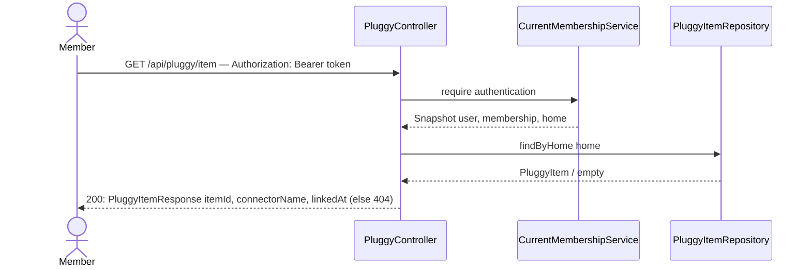

# View my Home's Pluggy connection

## What it does

Lets any member of a Home (OWNER or VIEWER) check whether their Home has a bank connected, and which one, without re-running the widget flow.

## Why

After slice 02 links an Item, the SPA needs a way to render connection state on page load/refresh — "Connected to Nubank since Sep 23" vs "Not connected yet, click here to connect" — the same problem `GET /api/me` solves for session state (`auth-and-login/05-me-get.md`). This is read-only status, so unlike linking it is not OWNER-gated: a VIEWER can see the connection but not create or change it, matching the existing Role split ("Viewer: Can read financial data but cannot modify the Home").

## Data flow



## Today → after

**Today** in [`PluggyController.java`](../../src/main/java/com/glpalma/HomeTreasury/pluggy/PluggyController.java) (slice 02): `connectToken()` and `linkItem()` only.

**After:** adds a `getItem` method (the class now has two methods named around "item" doing different HTTP verbs — `linkItem`/`getItem` — kept distinct from `PluggyClient.getItem`, which fetches from Pluggy, not the local repository).

## Exact changes

- [ ] **Edit** [`src/main/java/com/glpalma/HomeTreasury/pluggy/PluggyController.java`](../../src/main/java/com/glpalma/HomeTreasury/pluggy/PluggyController.java) — add `GET /api/pluggy/item`
  ```java
  package com.glpalma.HomeTreasury.pluggy;

  import com.glpalma.HomeTreasury.home.Home;
  import com.glpalma.HomeTreasury.home.PluggyItem;
  import com.glpalma.HomeTreasury.home.PluggyItemRepository;
  import com.glpalma.HomeTreasury.user.CurrentMembershipService;
  import jakarta.validation.Valid;
  import org.springframework.http.HttpStatus;
  import org.springframework.security.access.prepost.PreAuthorize;
  import org.springframework.security.core.Authentication;
  import org.springframework.web.bind.annotation.*;
  import org.springframework.web.client.HttpClientErrorException;
  import org.springframework.web.server.ResponseStatusException;

  import java.time.Instant;

  @RestController
  @RequestMapping("/api/pluggy")
  public class PluggyController {

      private final PluggyClient pluggyClient;
      private final CurrentMembershipService memberships;
      private final PluggyItemRepository pluggyItems;

      public PluggyController(
              PluggyClient pluggyClient,
              CurrentMembershipService memberships,
              PluggyItemRepository pluggyItems
      ) {
          this.pluggyClient = pluggyClient;
          this.memberships = memberships;
          this.pluggyItems = pluggyItems;
      }

      @PreAuthorize("hasRole('OWNER')")
      @PostMapping("/connect-token")
      public PluggyConnectTokenResponse connectToken() {
          return pluggyClient.getConnectToken();
      }

      @PreAuthorize("hasRole('OWNER')")
      @PostMapping("/item")
      @ResponseStatus(HttpStatus.CREATED)
      public PluggyItemResponse linkItem(
              @Valid @RequestBody LinkPluggyItemRequest request,
              Authentication authentication
      ) {
          Home home = memberships.require(authentication).home();
          if (pluggyItems.findByHome(home).isPresent()) {
              throw new ResponseStatusException(HttpStatus.CONFLICT, "Home already has a linked Pluggy item");
          }

          PluggyItemDetails details;
          try {
              details = pluggyClient.getItem(request.itemId());
          } catch (HttpClientErrorException.NotFound ex) {
              throw new ResponseStatusException(HttpStatus.BAD_REQUEST, "Unknown Pluggy item");
          }

          PluggyItem saved = pluggyItems.save(new PluggyItem(
                  home,
                  details.id(),
                  details.connector() == null ? null : details.connector().name(),
                  Instant.now()
          ));
          return PluggyItemResponse.from(saved);
      }

      @GetMapping("/item")
      public PluggyItemResponse getItem(Authentication authentication) {
          Home home = memberships.require(authentication).home();
          PluggyItem item = pluggyItems.findByHome(home)
                  .orElseThrow(() -> new ResponseStatusException(
                          HttpStatus.NOT_FOUND, "No Pluggy item linked to this home"));
          return PluggyItemResponse.from(item);
      }
  }
  ```

## Verify

1. Before linking anything, call:
   ```
   curl -i http://localhost:8080/api/pluggy/item -H "Authorization: Bearer $OWNER_TOKEN"
   ```
2. Expect `404 Not Found`.
3. Link an item (slice 02's verify steps).
4. Repeat step 1. Expect `200 OK`:
   ```json
   { "itemId": "...", "connectorName": "Pluggy Bank", "linkedAt": "2026-09-23T23:00:00Z" }
   ```
5. Repeat step 1 as a VIEWER of the same Home. Expect `200 OK` with the same body — read access is not OWNER-gated.

## Out of scope

- Refreshing `status`/`connectorName` from Pluggy on every read — this returns exactly what slice 02 stored.
- Exposing this over `GET /api/home` instead of its own route — kept separate so this epic never has to touch `HomeController`, which has an unrelated pending migration (`auth-and-login/09-invite-generation.md`, not yet implemented).
