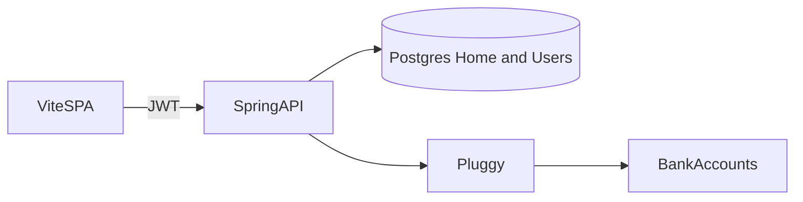
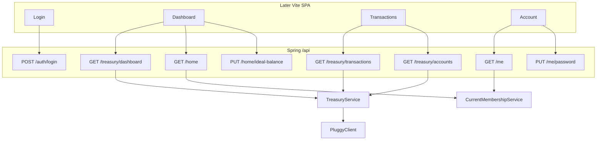

# Treasury dashboard API

The repo is a JWT-secured Spring Boot API with login, a write-only ideal balance, and raw Pluggy saldo/extrato proxies. A dashboard SPA needs a stable English API (summary, accounts, transactions, growth, under-balance alert, self-service account), CORS, and a few security/DTO fixes before any frontend work.

Implementation checklist:

- [ ] Enable method security, CORS for Vite, and `/api` route prefix
- [ ] Add `GET /api/me`, richer login response, `PUT /api/me/password`
- [ ] Add `GET /api/home` and return a body from ideal-balance PUT
- [ ] `TreasuryService` + accounts/transactions endpoints with date range and cursor
- [ ] `GET /api/treasury/dashboard`: current vs ideal, growth rate, under-balance alarm

---

Backend-only today: Spring Boot 4, JWT, one seeded Home + OWNER, Pluggy as the bank source. No frontend, no CORS, no dashboard-shaped API. A later React + Vite SPA in `/web` will send `Authorization: Bearer`. Frontend scaffolding is out of scope.

Every public path moves under `/api`. JWT is required except login. `VIEWER` can read; `OWNER` can also write ideal balance. Logout is client-side (delete the token). No refresh token in v1.

## Why these routes

The current paths (`/auth/login`, `/home/idealBalance`, `/saldo`, `/extrato`, `/ping-pluggy`) grew as one-off probes. They mix Portuguese bank jargon, English domain words, and a Pluggy diagnostic. The SPA needs a small, stable map that matches the domain (App user, Home, Treasury) and that a reverse proxy can target.

**Prefix everything with `/api`.** The Vite app will run on another origin (`localhost:5173` now; a static host later). `/api` is the CORS allowlist, the nginx/Caddy proxy target (`/api` → Spring), and a collision guard so the SPA can own `/`, `/login`, `/dashboard` without fighting REST. Security stays one matcher: `permitAll` on `/api/auth/login`, everything else authenticated.

**Four roots, one job each** — not a user CRUD tree and not Pluggy’s URL shape.

- `/api/auth` — how you **get** a token. Public. Kept off `/api/me` because `/me` is meaningless without a token.
- `/api/me` — the **App user** attached to that token (profile, password). Singular `me`, not `/api/users/{id}`: v1 has no user list, no invites, no admin. The id is always the JWT subject.
- `/api/home` — the **household settings** (name, ideal balance). Singular, not `/api/homes/{id}`: each membership already points at one Home. Add `{id}` only when a user can belong to several homes.
- `/api/treasury` — **money views** (accounts, transactions, dashboard). These are not Home columns; they are computed from Pluggy. They are not `/api/accounts` at the root because “account” already means App user.

**Dashboard lives under treasury, not home.** `GET /api/treasury/dashboard` is current balance + growth + under-balance alarm: all derived from bank data compared to `Home.idealBalance`. `GET/PUT /api/home` stays the settings resource. Putting health on `/api/home/health` would mix a writeable setting with a live Pluggy aggregation.

**Password is `PUT /api/me/password`, not `POST /api/auth/change-password`.** Changing a password is updating the current App user. It requires an existing session. `/api/auth` is only for obtaining a token.

**Kebab-case in the URL, camelCase in JSON.** `PUT /api/home/ideal-balance` with body `{ "idealBalance": 15000 }`. Paths follow HTTP convention; JSON follows the Java records. Today’s `/home/idealBalance` mixes the two.

**English, drop Portuguese and diagnostics.** `/saldo` and `/extrato` do not match the Java packages (`treasury`, `home`) and they return Pluggy’s `{ results }` wrapper. The SPA should talk in HomeTreasury language: accounts and transactions. `/ping-pluggy` returns an API-key prefix; it is not a product route. Pluggy failures become 502 on the treasury endpoints.

**No `/api/v1` yet.** One client, no shipped contract. `/api` already separates SPA from backend. Add a version segment when a breaking change actually ships.



## Domain terms

- **Home**: the household treasury unit (name + ideal balance). Not a bank account.
- **Bank account**: a Pluggy-linked account; current balance lives there.
- **App user**: email + password + membership (`OWNER` / `VIEWER`). “Manage account” means this, not a bank account.
- **Ideal balance**: target cash the Home should hold. OWNER sets it.
- **Treasury health**: current total balance vs ideal (`ABOVE` / `AT` / `BELOW`).
- **Growth rate**: net change in total balance over a period, derived from transactions (no snapshot table in v1).
- **Under-balance alarm**: computed flag when current total is below ideal. No notification channel in v1.

## Gap vs today

- Login: `POST /auth/login` returns `{ token }` only — no email/role/home.
- Balance: `GET /saldo` returns raw [PluggyAccountsResponse](src/main/java/com/glpalma/HomeTreasury/pluggy/PluggyAccountsResponse.java) — Portuguese path, Pluggy-shaped.
- Transactions: `GET /extrato?accountId=` returns raw [PluggyTransactionsResponse](src/main/java/com/glpalma/HomeTreasury/pluggy/PluggyTransactionsResponse.java) — no date range, `next` unused.
- Ideal balance: `PUT /home/idealBalance` is write-only, void body, no GET. `@PreAuthorize` on [HomeController](src/main/java/com/glpalma/HomeTreasury/home/HomeController.java) is a no-op because `@EnableMethodSecurity` is missing.
- Account: OWNER is seeded in [OwnerInitializer](src/main/java/com/glpalma/HomeTreasury/user/OwnerInitializer.java) — no `/me`, no password change.
- Growth / alarm: missing.

---

## Endpoint changes (today → after)

### 1. `POST /auth/login` → `POST /api/auth/login`

**Today** in [AuthController](src/main/java/com/glpalma/HomeTreasury/auth/AuthController.java): body `{ email, password }` ([LoginRequest](src/main/java/com/glpalma/HomeTreasury/auth/LoginRequest.java)); response `{ token }` ([LoginResponse](src/main/java/com/glpalma/HomeTreasury/auth/LoginResponse.java)); `permitAll` in [SecurityConfig](src/main/java/com/glpalma/HomeTreasury/config/SecurityConfig.java).

**After:**

- Same authenticate + load user + membership + JWT flow.
- Response `{ token, email, role }` so the SPA can render the shell without a second call. `GET /api/me` still exists for page refresh.
- `@Valid` + `@NotBlank` on email/password.
- `permitAll` matcher becomes `/api/auth/login`.
- Drop `POST /auth/login`.

### 2. New `GET /api/me`

**Today:** nothing. JWT subject is email and role is a claim, but the SPA has no HTTP way to load profile + home after a refresh.

**After:** authenticated. Resolve `Authentication.getName()` → [AppUser](src/main/java/com/glpalma/HomeTreasury/user/AppUser.java) → [HomeMembership](src/main/java/com/glpalma/HomeTreasury/user/HomeMembership.java).

```json
{
  "email": "owner@example.com",
  "role": "OWNER",
  "home": { "id": 1, "name": "Casa" }
}
```

- 401 if the token is missing/invalid (filter + entry point already do this).
- 404/401 if the user or membership row is gone.
- Lives on a new `MeController` mapped to `/api/me`, not on `AuthController` (login is public; this is not).

### 3. New `PUT /api/me/password`

**Today:** password is only set in [OwnerInitializer](src/main/java/com/glpalma/HomeTreasury/user/OwnerInitializer.java). [AppUser](src/main/java/com/glpalma/HomeTreasury/user/AppUser.java) has no setter for `passwordHash`.

**After:** authenticated, self only. Body `{ currentPassword, newPassword }`. Verify with `PasswordEncoder.matches`; 401/400 if current is wrong; hash and persist; **204 No Content**. Does **not** invalidate existing JWTs (stateless). The SPA may discard the token after a password change if it wants to force re-login.

### 4. New `GET /api/home`

**Today:** Home is only written via `PUT /home/idealBalance` and seeded by [HomeInitializer](src/main/java/com/glpalma/HomeTreasury/home/HomeInitializer.java). The dashboard cannot show the target.

**After:** authenticated, OWNER and VIEWER. Same membership lookup as `/me`, then `membership.getHome()`. Response `{ id, name, idealBalance }`.

### 5. `PUT /home/idealBalance` → `PUT /api/home/ideal-balance`

**Today** in [HomeController](src/main/java/com/glpalma/HomeTreasury/home/HomeController.java): `@PreAuthorize("hasRole('OWNER')")` is not enforced; body `{ idealBalance }` ([BalanceRequest](src/main/java/com/glpalma/HomeTreasury/home/BalanceRequest.java)); return `void` → 200 empty.

**After:**

- OWNER-only, actually enforced once `@EnableMethodSecurity` is on.
- `@Valid` + `@NotNull` on `idealBalance`.
- Return `HomeResponse` (same shape as GET) so the SPA can update without refetching.
- Drop `PUT /home/idealBalance`.

### 6. `GET /saldo` → `GET /api/treasury/accounts`

**Today** in [TreasuryController](src/main/java/com/glpalma/HomeTreasury/treasury/TreasuryController.java): returns [PluggyAccountsResponse](src/main/java/com/glpalma/HomeTreasury/pluggy/PluggyAccountsResponse.java) (`{ results: [PluggyAccount] }`). Leaks Pluggy field names and the `results` wrapper.

**After:** drop `/saldo`. Controller calls `TreasuryService.listAccounts()` → `PluggyClient.getAccounts()` → map each [PluggyAccount](src/main/java/com/glpalma/HomeTreasury/pluggy/PluggyAccount.java) to an app DTO.

```json
{
  "accounts": [
    { "id": "...", "name": "...", "type": "...", "subtype": "...", "balance": 0, "currencyCode": "BRL" }
  ]
}
```

Empty list is 200, not an exception.

### 7. `GET /extrato` → `GET /api/treasury/transactions`

**Today:** `GET /extrato?accountId=` uses the **first** Pluggy account if `accountId` is missing; throws `IllegalStateException` if none (unmapped → 500). [PluggyClient.getTransactions](src/main/java/com/glpalma/HomeTreasury/pluggy/PluggyClient.java) hits `/v2/transactions?accountId=` only — no dates, no page size; response `next` is ignored.

**After:** drop `/extrato`. Query params:

- `accountId` optional. Omitted → fetch every bank account and merge. Present → one account.
- `from` / `to` optional ISO dates, forwarded to Pluggy.
- `cursor` optional, forwarded as Pluggy’s page cursor.
- `pageSize` optional, default 50.

```json
{
  "items": [
    {
      "id": "...",
      "accountId": "...",
      "description": "...",
      "amount": 0,
      "date": "2026-08-01",
      "type": "DEBIT",
      "category": "..."
    }
  ],
  "nextCursor": "..."
}
```

`accountId` is filled in during mapping (Pluggy’s [PluggyTransaction](src/main/java/com/glpalma/HomeTreasury/pluggy/PluggyTransaction.java) does not include it). Unknown `accountId` → 404, not 500.

### 8. New `GET /api/treasury/dashboard?periodDays=30`

**Today:** no aggregation. The SPA would GET saldo + GET home and still could not compute growth without date-filtered transactions.

**After:** `TreasuryService` will:

1. Load Home `idealBalance` via the current user’s membership.
2. Sum `balance` across Pluggy accounts → `currentBalance`.
3. `delta = currentBalance - idealBalance`.
4. `status`: `BELOW` if current < ideal, `AT` if equal, `ABOVE` otherwise.
5. `alarm.underBalance = (status == BELOW)` — no extra config; the threshold **is** ideal balance.
6. Growth: fetch transactions in `[now - periodDays, now]`, `netChange = sum(amount)`, `rate = netChange / max(|openingBalance|, epsilon)` where `openingBalance = currentBalance - netChange`.

```json
{
  "currentBalance": 12500.00,
  "idealBalance": 15000.00,
  "delta": -2500.00,
  "status": "BELOW",
  "growth": { "periodDays": 30, "netChange": -400.00, "rate": -0.031 },
  "alarm": { "underBalance": true }
}
```

No `PUT` alarm endpoint in v1.

### 9. Drop `GET /ping-pluggy`

It returns a truncated Pluggy API key prefix. Auth/connectivity failures should surface as 502 from the treasury endpoints instead.



---

## Exact file changes

No new DB tables. Password change reuses `users.password_hash`. Files not listed here are left untouched.

### [pom.xml](pom.xml)

Write the full file. Only change vs today: `spring-boot-starter-validation` immediately after `spring-boot-starter-web`.

```xml
<?xml version="1.0" encoding="UTF-8"?>
<project xmlns="http://maven.apache.org/POM/4.0.0" xmlns:xsi="http://www.w3.org/2001/XMLSchema-instance"
	xsi:schemaLocation="http://maven.apache.org/POM/4.0.0 https://maven.apache.org/xsd/maven-4.0.0.xsd">
	<modelVersion>4.0.0</modelVersion>
	<parent>
		<groupId>org.springframework.boot</groupId>
		<artifactId>spring-boot-starter-parent</artifactId>
		<version>4.1.0</version>
		<relativePath/>
	</parent>
	<groupId>com.glpalma</groupId>
	<artifactId>HomeTreasury</artifactId>
	<version>0.0.1-SNAPSHOT</version>
	<properties>
		<java.version>21</java.version>
	</properties>
	<dependencies>
		<dependency>
			<groupId>org.springframework.boot</groupId>
			<artifactId>spring-boot-starter-web</artifactId>
		</dependency>
		<dependency>
			<groupId>org.springframework.boot</groupId>
			<artifactId>spring-boot-starter-validation</artifactId>
		</dependency>
		<dependency>
			<groupId>org.springframework.boot</groupId>
			<artifactId>spring-boot-starter-test</artifactId>
			<scope>test</scope>
		</dependency>
		<dependency>
			<groupId>me.paulschwarz</groupId>
			<artifactId>springboot4-dotenv</artifactId>
			<version>5.1.0</version>
		</dependency>
		<dependency>
			<groupId>org.springframework.boot</groupId>
			<artifactId>spring-boot-starter-data-jpa</artifactId>
		</dependency>
		<dependency>
			<groupId>org.postgresql</groupId>
			<artifactId>postgresql</artifactId>
			<scope>runtime</scope>
		</dependency>
		<dependency>
			<groupId>com.h2database</groupId>
			<artifactId>h2</artifactId>
			<scope>test</scope>
		</dependency>
		<dependency>
			<groupId>org.springframework.security</groupId>
			<artifactId>spring-security-crypto</artifactId>
		</dependency>
		<dependency>
			<groupId>org.springframework.boot</groupId>
			<artifactId>spring-boot-starter-security</artifactId>
		</dependency>
		<dependency>
			<groupId>io.jsonwebtoken</groupId>
			<artifactId>jjwt-api</artifactId>
			<version>0.12.6</version>
		</dependency>
		<dependency>
			<groupId>io.jsonwebtoken</groupId>
			<artifactId>jjwt-impl</artifactId>
			<version>0.12.6</version>
			<scope>runtime</scope>
		</dependency>
		<dependency>
			<groupId>io.jsonwebtoken</groupId>
			<artifactId>jjwt-jackson</artifactId>
			<version>0.12.6</version>
			<scope>runtime</scope>
		</dependency>
	</dependencies>
	<build>
		<plugins>
			<plugin>
				<groupId>org.springframework.boot</groupId>
				<artifactId>spring-boot-maven-plugin</artifactId>
			</plugin>
		</plugins>
	</build>
</project>
```

### [application.properties](src/main/resources/application.properties)

```
spring.application.name=HomeTreasury
pluggy.client-id=${PLUGGY_CLIENT_ID}
pluggy.client-secret=${PLUGGY_CLIENT_SECRET}
pluggy.item-id=${PLUGGY_ITEM_ID}

spring.datasource.url=${DB_URL}
spring.datasource.username=${DB_USER}
spring.datasource.password=${DB_PASSWORD}
spring.jpa.hibernate.ddl-auto=update
spring.jpa.show-sql=true
home.name=${HOME_NAME}
home.ideal-balance=${HOME_IDEAL_BALANCE}

owner.email=${OWNER_EMAIL}
owner.password=${OWNER_PASSWORD}

jwt.secret=${JWT_SECRET}
jwt.expiration-ms=${JWT_EXPIRATION_MS}

app.cors.allowed-origins=http://localhost:5173
```

### [src/test/resources/application.properties](src/test/resources/application.properties)

```
spring.datasource.url=jdbc:h2:mem:testdb
spring.datasource.driver-class-name=org.h2.Driver
spring.datasource.username=sa
spring.datasource.password=
spring.jpa.hibernate.ddl-auto=create-drop
home.name=TestHome
home.ideal-balance=100
pluggy.client-id=test-client-id
pluggy.client-secret=test-client-secret
pluggy.item-id=test-item-id

owner.email=owner@test.local
owner.password=test-password

jwt.secret=test-jwt-secret-must-be-at-least-32-chars-long
jwt.expiration-ms=3600000

app.cors.allowed-origins=http://localhost:5173
```

### [HomeTreasuryApplication.java](src/main/java/com/glpalma/HomeTreasury/HomeTreasuryApplication.java)

```java
package com.glpalma.HomeTreasury;

import com.glpalma.HomeTreasury.config.CorsProperties;
import com.glpalma.HomeTreasury.config.HomeProperties;
import com.glpalma.HomeTreasury.config.JwtProperties;
import com.glpalma.HomeTreasury.config.OwnerProperties;
import com.glpalma.HomeTreasury.config.PluggyProperties;
import org.springframework.boot.SpringApplication;
import org.springframework.boot.autoconfigure.SpringBootApplication;
import org.springframework.boot.context.properties.EnableConfigurationProperties;

@SpringBootApplication
@EnableConfigurationProperties({
		PluggyProperties.class,
		HomeProperties.class,
		OwnerProperties.class,
		JwtProperties.class,
		CorsProperties.class
})
public class HomeTreasuryApplication {

	public static void main(String[] args) {
		SpringApplication.run(HomeTreasuryApplication.class, args);
	}

}
```

### [SecurityConfig.java](src/main/java/com/glpalma/HomeTreasury/config/SecurityConfig.java)

```java
package com.glpalma.HomeTreasury.config;

import com.glpalma.HomeTreasury.auth.JwtAuthFilter;
import org.springframework.context.annotation.Bean;
import org.springframework.context.annotation.Configuration;
import org.springframework.http.HttpStatus;
import org.springframework.security.authentication.AuthenticationManager;
import org.springframework.security.config.Customizer;
import org.springframework.security.config.annotation.authentication.configuration.AuthenticationConfiguration;
import org.springframework.security.config.annotation.method.configuration.EnableMethodSecurity;
import org.springframework.security.config.annotation.web.builders.HttpSecurity;
import org.springframework.security.config.http.SessionCreationPolicy;
import org.springframework.security.web.SecurityFilterChain;
import org.springframework.security.web.authentication.HttpStatusEntryPoint;
import org.springframework.security.web.authentication.UsernamePasswordAuthenticationFilter;
import org.springframework.web.cors.CorsConfiguration;
import org.springframework.web.cors.CorsConfigurationSource;
import org.springframework.web.cors.UrlBasedCorsConfigurationSource;

import java.util.List;

@Configuration
@EnableMethodSecurity
public class SecurityConfig {

    @Bean
    AuthenticationManager authenticationManager(AuthenticationConfiguration config) throws Exception {
        return config.getAuthenticationManager();
    }

    @Bean
    SecurityFilterChain securityFilterChain(HttpSecurity http, JwtAuthFilter jwtAuthFilter) throws Exception {
        http
                .csrf(csrf -> csrf.disable())
                .cors(Customizer.withDefaults())
                .sessionManagement(session -> session.sessionCreationPolicy(SessionCreationPolicy.STATELESS))
                .authorizeHttpRequests(auth -> auth
                        .requestMatchers("/api/auth/login").permitAll()
                        .anyRequest().authenticated()
                )
                .exceptionHandling(ex -> ex
                        .authenticationEntryPoint(new HttpStatusEntryPoint(HttpStatus.UNAUTHORIZED))
                )
                .addFilterBefore(jwtAuthFilter, UsernamePasswordAuthenticationFilter.class);
        return http.build();
    }

    @Bean
    CorsConfigurationSource corsConfigurationSource(CorsProperties corsProperties) {
        CorsConfiguration config = new CorsConfiguration();
        config.setAllowedOrigins(corsProperties.allowedOrigins());
        config.setAllowedMethods(List.of("GET", "POST", "PUT", "OPTIONS"));
        config.setAllowedHeaders(List.of("Authorization", "Content-Type"));
        UrlBasedCorsConfigurationSource source = new UrlBasedCorsConfigurationSource();
        source.registerCorsConfiguration("/api/**", config);
        return source;
    }
}
```

### New [CorsProperties.java](src/main/java/com/glpalma/HomeTreasury/config/CorsProperties.java)

```java
package com.glpalma.HomeTreasury.config;

import org.springframework.boot.context.properties.ConfigurationProperties;

import java.util.List;

@ConfigurationProperties(prefix = "app.cors")
public record CorsProperties(List<String> allowedOrigins) {
}
```

### [LoginRequest.java](src/main/java/com/glpalma/HomeTreasury/auth/LoginRequest.java)

```java
package com.glpalma.HomeTreasury.auth;

import jakarta.validation.constraints.NotBlank;

public record LoginRequest(@NotBlank String email, @NotBlank String password) {
}
```

### [LoginResponse.java](src/main/java/com/glpalma/HomeTreasury/auth/LoginResponse.java)

```java
package com.glpalma.HomeTreasury.auth;

public record LoginResponse(String token, String email, String role) {
}
```

### [AuthController.java](src/main/java/com/glpalma/HomeTreasury/auth/AuthController.java)

```java
package com.glpalma.HomeTreasury.auth;

import com.glpalma.HomeTreasury.user.AppUser;
import com.glpalma.HomeTreasury.user.AppUserRepository;
import com.glpalma.HomeTreasury.user.HomeMembership;
import com.glpalma.HomeTreasury.user.HomeMembershipRepository;
import jakarta.validation.Valid;
import org.springframework.http.HttpStatus;
import org.springframework.security.authentication.AuthenticationManager;
import org.springframework.security.authentication.UsernamePasswordAuthenticationToken;
import org.springframework.security.core.AuthenticationException;
import org.springframework.web.bind.annotation.*;
import org.springframework.web.server.ResponseStatusException;

@RestController
@RequestMapping("/api/auth")
public class AuthController {

    private final AuthenticationManager authenticationManager;
    private final AppUserRepository users;
    private final HomeMembershipRepository memberships;
    private final JwtService jwtService;

    public AuthController(
            AuthenticationManager authenticationManager,
            AppUserRepository users,
            HomeMembershipRepository memberships,
            JwtService jwtService
    ) {
        this.authenticationManager = authenticationManager;
        this.users = users;
        this.memberships = memberships;
        this.jwtService = jwtService;
    }

    @PostMapping("/login")
    public LoginResponse login(@Valid @RequestBody LoginRequest request) {
        try {
            authenticationManager.authenticate(
                    new UsernamePasswordAuthenticationToken(request.email(), request.password())
            );
        } catch (AuthenticationException ex) {
            throw new ResponseStatusException(HttpStatus.UNAUTHORIZED, "Invalid credentials");
        }
        AppUser user = users.findByEmail(request.email())
                .orElseThrow(() -> new ResponseStatusException(HttpStatus.UNAUTHORIZED, "Invalid credentials"));
        HomeMembership membership = memberships.findByUser(user)
                .orElseThrow(() -> new ResponseStatusException(HttpStatus.UNAUTHORIZED, "Invalid credentials"));
        String token = jwtService.createToken(user.getEmail(), membership.getRole().name());
        return new LoginResponse(token, user.getEmail(), membership.getRole().name());
    }
}
```

### [AppUser.java](src/main/java/com/glpalma/HomeTreasury/user/AppUser.java)

```java
package com.glpalma.HomeTreasury.user;

import jakarta.persistence.*;

@Entity
@Table(name = "users")
public class AppUser {
    @Id
    @GeneratedValue(strategy = GenerationType.IDENTITY)
    private Long id;

    @Column(nullable = false, unique = true)
    private String email;

    @Column(nullable = false)
    private String passwordHash;

    protected AppUser() {

    }

    public AppUser(String email, String passwordHash) {
        this.email = email;
        this.passwordHash = passwordHash;
    }

    public String getEmail() {
        return email;
    }

    public Long getId() {
        return id;
    }

    public String getPasswordHash() {
        return passwordHash;
    }

    public void setPasswordHash(String passwordHash) {
        this.passwordHash = passwordHash;
    }
}
```

### New [CurrentMembershipService.java](src/main/java/com/glpalma/HomeTreasury/user/CurrentMembershipService.java)

```java
package com.glpalma.HomeTreasury.user;

import com.glpalma.HomeTreasury.home.Home;
import org.springframework.http.HttpStatus;
import org.springframework.security.core.Authentication;
import org.springframework.stereotype.Service;
import org.springframework.web.server.ResponseStatusException;

@Service
public class CurrentMembershipService {
    public record Snapshot(AppUser user, HomeMembership membership, Home home) {
    }

    private final AppUserRepository users;
    private final HomeMembershipRepository memberships;

    public CurrentMembershipService(AppUserRepository users, HomeMembershipRepository memberships) {
        this.users = users;
        this.memberships = memberships;
    }

    public Snapshot require(Authentication authentication) {
        String email = authentication.getName();
        AppUser user = users.findByEmail(email)
                .orElseThrow(() -> new ResponseStatusException(HttpStatus.UNAUTHORIZED));
        HomeMembership membership = memberships.findByUser(user)
                .orElseThrow(() -> new ResponseStatusException(HttpStatus.FORBIDDEN));
        return new Snapshot(user, membership, membership.getHome());
    }
}
```

### New [MeResponse.java](src/main/java/com/glpalma/HomeTreasury/user/MeResponse.java)

```java
package com.glpalma.HomeTreasury.user;

public record MeResponse(String email, String role, HomeSummary home) {
    public record HomeSummary(Long id, String name) {
    }
}
```

### New [ChangePasswordRequest.java](src/main/java/com/glpalma/HomeTreasury/user/ChangePasswordRequest.java)

```java
package com.glpalma.HomeTreasury.user;

import jakarta.validation.constraints.NotBlank;
import jakarta.validation.constraints.Size;

public record ChangePasswordRequest(
        @NotBlank String currentPassword,
        @NotBlank @Size(min = 8) String newPassword
) {
}
```

### New [MeController.java](src/main/java/com/glpalma/HomeTreasury/user/MeController.java)

```java
package com.glpalma.HomeTreasury.user;

import jakarta.validation.Valid;
import org.springframework.http.HttpStatus;
import org.springframework.security.core.Authentication;
import org.springframework.security.crypto.password.PasswordEncoder;
import org.springframework.web.bind.annotation.*;
import org.springframework.web.server.ResponseStatusException;

@RestController
@RequestMapping("/api/me")
public class MeController {
    private final CurrentMembershipService memberships;
    private final AppUserRepository users;
    private final PasswordEncoder passwordEncoder;

    public MeController(
            CurrentMembershipService memberships,
            AppUserRepository users,
            PasswordEncoder passwordEncoder
    ) {
        this.memberships = memberships;
        this.users = users;
        this.passwordEncoder = passwordEncoder;
    }

    @GetMapping
    public MeResponse me(Authentication authentication) {
        var snapshot = memberships.require(authentication);
        return new MeResponse(
                snapshot.user().getEmail(),
                snapshot.membership().getRole().name(),
                new MeResponse.HomeSummary(snapshot.home().getId(), snapshot.home().getName())
        );
    }

    @PutMapping("/password")
    @ResponseStatus(HttpStatus.NO_CONTENT)
    public void changePassword(
            @Valid @RequestBody ChangePasswordRequest request,
            Authentication authentication
    ) {
        AppUser user = memberships.require(authentication).user();
        if (!passwordEncoder.matches(request.currentPassword(), user.getPasswordHash())) {
            throw new ResponseStatusException(HttpStatus.UNAUTHORIZED, "Invalid current password");
        }
        user.setPasswordHash(passwordEncoder.encode(request.newPassword()));
        users.save(user);
    }
}
```

### [BalanceRequest.java](src/main/java/com/glpalma/HomeTreasury/home/BalanceRequest.java)

```java
package com.glpalma.HomeTreasury.home;

import jakarta.validation.constraints.NotNull;

import java.math.BigDecimal;

public record BalanceRequest(@NotNull BigDecimal idealBalance) {
}
```

Do not rename the type.

### New [HomeResponse.java](src/main/java/com/glpalma/HomeTreasury/home/HomeResponse.java)

```java
package com.glpalma.HomeTreasury.home;

import java.math.BigDecimal;

public record HomeResponse(Long id, String name, BigDecimal idealBalance) {
    public static HomeResponse from(Home home) {
        return new HomeResponse(home.getId(), home.getName(), home.getIdealBalance());
    }
}
```

### [HomeController.java](src/main/java/com/glpalma/HomeTreasury/home/HomeController.java)

Replace the whole class. Drop `AppUserRepository` / `HomeMembershipRepository` / inline lookup. Keep `HomeRepository` for the PUT save.

```java
package com.glpalma.HomeTreasury.home;

import com.glpalma.HomeTreasury.user.CurrentMembershipService;
import jakarta.validation.Valid;
import org.springframework.security.access.prepost.PreAuthorize;
import org.springframework.security.core.Authentication;
import org.springframework.web.bind.annotation.GetMapping;
import org.springframework.web.bind.annotation.PutMapping;
import org.springframework.web.bind.annotation.RequestBody;
import org.springframework.web.bind.annotation.RequestMapping;
import org.springframework.web.bind.annotation.RestController;

@RestController
@RequestMapping("/api/home")
public class HomeController {
    private final CurrentMembershipService memberships;
    private final HomeRepository homes;

    public HomeController(CurrentMembershipService memberships, HomeRepository homes) {
        this.memberships = memberships;
        this.homes = homes;
    }

    @GetMapping
    public HomeResponse get(Authentication authentication) {
        return HomeResponse.from(memberships.require(authentication).home());
    }

    @PreAuthorize("hasRole('OWNER')")
    @PutMapping("/ideal-balance")
    public HomeResponse setIdealBalance(
            @Valid @RequestBody BalanceRequest request,
            Authentication authentication
    ) {
        Home home = memberships.require(authentication).home();
        home.setIdealBalance(request.idealBalance());
        homes.save(home);
        return HomeResponse.from(home);
    }
}
```

### [PluggyClient.java](src/main/java/com/glpalma/HomeTreasury/pluggy/PluggyClient.java)

```java
package com.glpalma.HomeTreasury.pluggy;

import com.glpalma.HomeTreasury.config.PluggyProperties;
import org.springframework.stereotype.Component;
import org.springframework.web.client.RestClient;

import java.time.LocalDate;
import java.util.Map;

@Component
public class PluggyClient {

    private final RestClient restClient;
    private final PluggyProperties properties;

    public PluggyClient(RestClient pluggyRestClient, PluggyProperties properties) {
        this.restClient = pluggyRestClient;
        this.properties = properties;
    }

    private RestClient.RequestHeadersSpec<?> authorizedGet(String uri) {
        return restClient.get()
                .uri(uri)
                .header("X-API-KEY", getApiKey());
    }

    private String getApiKey() {
        PluggyAuthResponse response = restClient.post()
                .uri("/auth")
                .body(Map.of(
                        "clientId", properties.clientId(),
                        "clientSecret", properties.clientSecret()
                ))
                .retrieve()
                .body(PluggyAuthResponse.class);
        if (response == null || response.apiKey() == null) {
            throw new IllegalStateException("Pluggy auth returned empty apiKey");
        }
        return response.apiKey();
    }

    public PluggyAccountsResponse getAccounts() {
        return authorizedGet("/accounts?itemId=" + properties.itemId())
                .retrieve()
                .body(PluggyAccountsResponse.class);
    }

    public PluggyTransactionsResponse getTransactions(
            String accountId,
            LocalDate from,
            LocalDate to,
            String cursor,
            Integer pageSize
    ) {
        return restClient.get()
                .uri(uriBuilder -> {
                    uriBuilder.path("/v2/transactions").queryParam("accountId", accountId);
                    if (from != null) {
                        uriBuilder.queryParam("from", from.toString());
                    }
                    if (to != null) {
                        uriBuilder.queryParam("to", to.toString());
                    }
                    if (cursor != null && !cursor.isBlank()) {
                        uriBuilder.queryParam("page", cursor);
                    }
                    if (pageSize != null) {
                        uriBuilder.queryParam("pageSize", pageSize);
                    }
                    return uriBuilder.build();
                })
                .header("X-API-KEY", getApiKey())
                .retrieve()
                .body(PluggyTransactionsResponse.class);
    }
}
```

### New treasury DTOs

[BankAccountResponse.java](src/main/java/com/glpalma/HomeTreasury/treasury/BankAccountResponse.java):

```java
package com.glpalma.HomeTreasury.treasury;

import java.math.BigDecimal;

public record BankAccountResponse(
        String id,
        String name,
        String type,
        String subtype,
        BigDecimal balance,
        String currencyCode
) {
}
```

[AccountsResponse.java](src/main/java/com/glpalma/HomeTreasury/treasury/AccountsResponse.java):

```java
package com.glpalma.HomeTreasury.treasury;

import java.util.List;

public record AccountsResponse(List<BankAccountResponse> accounts) {
}
```

[TransactionResponse.java](src/main/java/com/glpalma/HomeTreasury/treasury/TransactionResponse.java):

```java
package com.glpalma.HomeTreasury.treasury;

import java.math.BigDecimal;

public record TransactionResponse(
        String id,
        String accountId,
        String description,
        BigDecimal amount,
        String date,
        String type,
        String category
) {
}
```

[TransactionListResponse.java](src/main/java/com/glpalma/HomeTreasury/treasury/TransactionListResponse.java):

```java
package com.glpalma.HomeTreasury.treasury;

import java.util.List;

public record TransactionListResponse(List<TransactionResponse> items, String nextCursor) {
}
```

[HealthStatus.java](src/main/java/com/glpalma/HomeTreasury/treasury/HealthStatus.java):

```java
package com.glpalma.HomeTreasury.treasury;

public enum HealthStatus {
    ABOVE,
    AT,
    BELOW
}
```

[DashboardResponse.java](src/main/java/com/glpalma/HomeTreasury/treasury/DashboardResponse.java):

```java
package com.glpalma.HomeTreasury.treasury;

import java.math.BigDecimal;

public record DashboardResponse(
        BigDecimal currentBalance,
        BigDecimal idealBalance,
        BigDecimal delta,
        HealthStatus status,
        Growth growth,
        Alarm alarm
) {
    public record Growth(int periodDays, BigDecimal netChange, BigDecimal rate) {
    }

    public record Alarm(boolean underBalance) {
    }
}
```

[AccountNotFoundException.java](src/main/java/com/glpalma/HomeTreasury/treasury/AccountNotFoundException.java):

```java
package com.glpalma.HomeTreasury.treasury;

public class AccountNotFoundException extends RuntimeException {
    public AccountNotFoundException(String accountId) {
        super("Unknown bank account: " + accountId);
    }
}
```

### New [TreasuryService.java](src/main/java/com/glpalma/HomeTreasury/treasury/TreasuryService.java)

```java
package com.glpalma.HomeTreasury.treasury;

import com.glpalma.HomeTreasury.home.Home;
import com.glpalma.HomeTreasury.pluggy.PluggyAccount;
import com.glpalma.HomeTreasury.pluggy.PluggyClient;
import com.glpalma.HomeTreasury.pluggy.PluggyTransaction;
import com.glpalma.HomeTreasury.pluggy.PluggyTransactionsResponse;
import org.springframework.stereotype.Service;

import java.math.BigDecimal;
import java.math.RoundingMode;
import java.time.LocalDate;
import java.util.ArrayList;
import java.util.Comparator;
import java.util.List;

@Service
public class TreasuryService {
    private static final int DEFAULT_PAGE_SIZE = 50;
    private static final BigDecimal EPSILON = new BigDecimal("0.01");

    private final PluggyClient pluggyClient;

    public TreasuryService(PluggyClient pluggyClient) {
        this.pluggyClient = pluggyClient;
    }

    public AccountsResponse listAccounts() {
        List<PluggyAccount> results = pluggyClient.getAccounts().results();
        if (results == null) {
            return new AccountsResponse(List.of());
        }
        return new AccountsResponse(results.stream().map(this::toBankAccount).toList());
    }

    public TransactionListResponse listTransactions(
            String accountId,
            LocalDate from,
            LocalDate to,
            String cursor,
            Integer pageSize
    ) {
        int size = pageSize == null ? DEFAULT_PAGE_SIZE : pageSize;
        List<PluggyAccount> accounts = accountsOrEmpty();
        if (accountId != null && !accountId.isBlank()) {
            PluggyAccount match = accounts.stream()
                    .filter(a -> accountId.equals(a.id()))
                    .findFirst()
                    .orElseThrow(() -> new AccountNotFoundException(accountId));
            PluggyTransactionsResponse page = pluggyClient.getTransactions(match.id(), from, to, cursor, size);
            return toListResponse(match.id(), page);
        }
        List<TransactionResponse> items = new ArrayList<>();
        for (PluggyAccount account : accounts) {
            PluggyTransactionsResponse page = pluggyClient.getTransactions(account.id(), from, to, null, size);
            items.addAll(mapPage(account.id(), page));
        }
        items.sort(Comparator.comparing(TransactionResponse::date).reversed());
        return new TransactionListResponse(items, null);
    }

    public DashboardResponse dashboard(Home home, int periodDays) {
        List<PluggyAccount> accounts = accountsOrEmpty();
        BigDecimal current = accounts.stream()
                .map(a -> a.balance() == null ? BigDecimal.ZERO : a.balance())
                .reduce(BigDecimal.ZERO, BigDecimal::add);
        BigDecimal ideal = home.getIdealBalance() == null ? BigDecimal.ZERO : home.getIdealBalance();
        BigDecimal delta = current.subtract(ideal);
        HealthStatus status = delta.signum() < 0 ? HealthStatus.BELOW
                : delta.signum() == 0 ? HealthStatus.AT
                : HealthStatus.ABOVE;

        LocalDate to = LocalDate.now();
        LocalDate from = to.minusDays(periodDays);
        BigDecimal netChange = BigDecimal.ZERO;
        for (PluggyAccount account : accounts) {
            PluggyTransactionsResponse page = pluggyClient.getTransactions(account.id(), from, to, null, 500);
            if (page.results() != null) {
                for (PluggyTransaction tx : page.results()) {
                    if (tx.amount() != null) {
                        netChange = netChange.add(tx.amount());
                    }
                }
            }
        }
        BigDecimal opening = current.subtract(netChange).abs().max(EPSILON);
        BigDecimal rate = netChange.divide(opening, 4, RoundingMode.HALF_UP);
        return new DashboardResponse(
                current,
                ideal,
                delta,
                status,
                new DashboardResponse.Growth(periodDays, netChange, rate),
                new DashboardResponse.Alarm(status == HealthStatus.BELOW)
        );
    }

    private List<PluggyAccount> accountsOrEmpty() {
        List<PluggyAccount> results = pluggyClient.getAccounts().results();
        return results == null ? List.of() : results;
    }

    private BankAccountResponse toBankAccount(PluggyAccount account) {
        return new BankAccountResponse(
                account.id(),
                account.name(),
                account.type(),
                account.subtype(),
                account.balance(),
                account.currencyCode()
        );
    }

    private TransactionListResponse toListResponse(String accountId, PluggyTransactionsResponse page) {
        return new TransactionListResponse(mapPage(accountId, page), page.next());
    }

    private List<TransactionResponse> mapPage(String accountId, PluggyTransactionsResponse page) {
        if (page.results() == null) {
            return List.of();
        }
        return page.results().stream()
                .map(tx -> new TransactionResponse(
                        tx.id(),
                        accountId,
                        tx.description(),
                        tx.amount(),
                        tx.date(),
                        tx.type(),
                        tx.category()
                ))
                .toList();
    }
}
```

When `accountId` is omitted, `nextCursor` is always `null` (first page of every account, merged). When it is present, `nextCursor` is Pluggy’s `next`. Unknown `accountId` throws `AccountNotFoundException`.

### [TreasuryController.java](src/main/java/com/glpalma/HomeTreasury/treasury/TreasuryController.java)

Replace the whole class. Delete `pingPluggy`, `saldo`, `extrato`. Do not inject `PluggyClient`.

```java
package com.glpalma.HomeTreasury.treasury;

import com.glpalma.HomeTreasury.user.CurrentMembershipService;
import org.springframework.security.core.Authentication;
import org.springframework.web.bind.annotation.GetMapping;
import org.springframework.web.bind.annotation.RequestMapping;
import org.springframework.web.bind.annotation.RequestParam;
import org.springframework.web.bind.annotation.RestController;

import java.time.LocalDate;

@RestController
@RequestMapping("/api/treasury")
public class TreasuryController {
    private final TreasuryService treasuryService;
    private final CurrentMembershipService memberships;

    public TreasuryController(TreasuryService treasuryService, CurrentMembershipService memberships) {
        this.treasuryService = treasuryService;
        this.memberships = memberships;
    }

    @GetMapping("/accounts")
    public AccountsResponse accounts() {
        return treasuryService.listAccounts();
    }

    @GetMapping("/transactions")
    public TransactionListResponse transactions(
            @RequestParam(required = false) String accountId,
            @RequestParam(required = false) LocalDate from,
            @RequestParam(required = false) LocalDate to,
            @RequestParam(required = false) String cursor,
            @RequestParam(required = false) Integer pageSize
    ) {
        return treasuryService.listTransactions(accountId, from, to, cursor, pageSize);
    }

    @GetMapping("/dashboard")
    public DashboardResponse dashboard(
            @RequestParam(defaultValue = "30") int periodDays,
            Authentication authentication
    ) {
        return treasuryService.dashboard(memberships.require(authentication).home(), periodDays);
    }
}
```

### New [ApiExceptionHandler.java](src/main/java/com/glpalma/HomeTreasury/web/ApiExceptionHandler.java)

```java
package com.glpalma.HomeTreasury.web;

import com.glpalma.HomeTreasury.treasury.AccountNotFoundException;
import org.springframework.http.HttpStatus;
import org.springframework.http.ProblemDetail;
import org.springframework.web.bind.MethodArgumentNotValidException;
import org.springframework.web.bind.annotation.ExceptionHandler;
import org.springframework.web.bind.annotation.RestControllerAdvice;
import org.springframework.web.client.RestClientException;

@RestControllerAdvice
public class ApiExceptionHandler {
    @ExceptionHandler(MethodArgumentNotValidException.class)
    ProblemDetail validation(MethodArgumentNotValidException ex) {
        ProblemDetail detail = ProblemDetail.forStatusAndDetail(HttpStatus.BAD_REQUEST, "Validation failed");
        detail.setProperty("errors", ex.getBindingResult().getFieldErrors().stream()
                .map(err -> err.getField() + " " + err.getDefaultMessage())
                .toList());
        return detail;
    }

    @ExceptionHandler(AccountNotFoundException.class)
    ProblemDetail unknownAccount(AccountNotFoundException ex) {
        return ProblemDetail.forStatusAndDetail(HttpStatus.NOT_FOUND, ex.getMessage());
    }

    @ExceptionHandler(RestClientException.class)
    ProblemDetail pluggyDown(RestClientException ex) {
        return ProblemDetail.forStatusAndDetail(HttpStatus.BAD_GATEWAY, "Bank data provider unavailable");
    }
}
```

`ResponseStatusException` from login / membership / wrong password stays handled by Spring (401/403). Do not catch it here.

### [HomeTreasuryApplicationTests.java](src/test/java/com/glpalma/HomeTreasury/HomeTreasuryApplicationTests.java)

No edits. `contextLoads` must still pass after `CorsProperties` is bound from test `application.properties`.

### Leave untouched

[JwtService](src/main/java/com/glpalma/HomeTreasury/auth/JwtService.java), [JwtAuthFilter](src/main/java/com/glpalma/HomeTreasury/auth/JwtAuthFilter.java), [AppUserDetailsService](src/main/java/com/glpalma/HomeTreasury/user/AppUserDetailsService.java), [PasswordConfig](src/main/java/com/glpalma/HomeTreasury/config/PasswordConfig.java), [Home](src/main/java/com/glpalma/HomeTreasury/home/Home.java), [HomeMembership](src/main/java/com/glpalma/HomeTreasury/user/HomeMembership.java), [Role](src/main/java/com/glpalma/HomeTreasury/user/Role.java), all repositories, [OwnerInitializer](src/main/java/com/glpalma/HomeTreasury/user/OwnerInitializer.java), [HomeInitializer](src/main/java/com/glpalma/HomeTreasury/home/HomeInitializer.java), [RestClientConfig](src/main/java/com/glpalma/HomeTreasury/config/RestClientConfig.java), [PluggyProperties](src/main/java/com/glpalma/HomeTreasury/config/PluggyProperties.java), [JwtProperties](src/main/java/com/glpalma/HomeTreasury/config/JwtProperties.java), [HomeProperties](src/main/java/com/glpalma/HomeTreasury/config/HomeProperties.java), [OwnerProperties](src/main/java/com/glpalma/HomeTreasury/config/OwnerProperties.java), Pluggy DTO records.

---

## Out of scope

- Public signup / invite VIEWER
- Email/push notifications for under-balance
- Persisted balance snapshots (growth from transactions is enough for v1)
- Changing Pluggy `itemId` from the UI
- Frontend routes, charts, or Vite app layout

## Implementation order

1. Security: method security + CORS + `/api` grouping.
2. `GET /api/me`, richer login, `PUT /api/me/password`.
3. `GET /api/home` + rename ideal-balance PUT with a response body.
4. `TreasuryService` + accounts/transactions DTOs + date/cursor query.
5. `GET /api/treasury/dashboard` (health, growth, alarm).
6. Drop `/saldo`, `/extrato`, `/ping-pluggy`.
